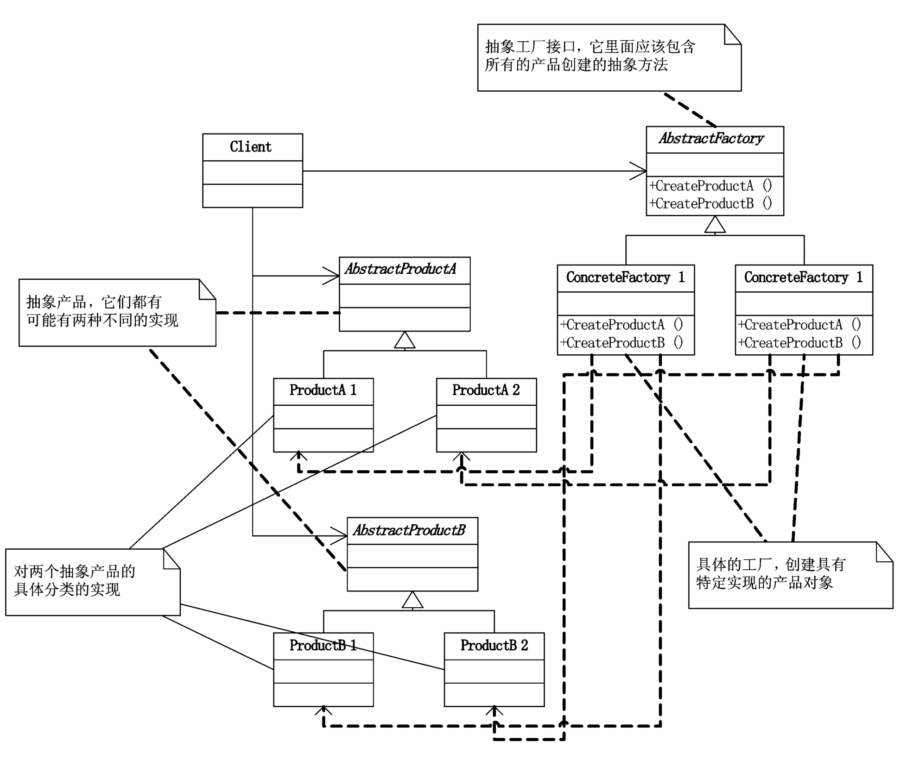

# 抽象工厂模式

## 模式引入

### 问题描述

数据库是应用中不可缺少的组件，假设我们的应用最开始时使用 MySQL，但是某一天突然需要接一个 Access，两个数据库在很多方面都不相同，原来的创建、更新、删除、查询相关代码都需要修改。最简单的方案是直接针对 Access 重新写一套，最外面用一个参数来判断是使用哪种库，并路由到对应的逻辑。

但是好景不长，又接到了一个 Oracle，这时候怎么办，再写一套新的，再多一个判断分支？当然也未尝不可。但这种情况已经出现两次了，聪明的你可能已经意识到了，万一过几天再来一个新的怎么办，干脆将业务逻辑和具体的库隔离开。

### 模式定义

当有多个产品或相关产品系列时，通过组合的方式将创建对象的任务委托给其他类，可以保证多个或系列产品的一致性。也使得交换产品系列更加方便，一个具体工厂只在初始化时出现一次，只需修改这里就可以使用不同的产品配置。

抽象工厂模式提供一个创建一系列相关或相互依赖对象的接口，而无需指定它们的具体类。它是一般化的工厂方法，可以看做一组工厂方法的集合。

### 问题分析

我们用抽象工厂模式重新设计开始时的问题。就是把增删改查的逻辑抽离出来，与实际的数据库解耦，我们通过新创建一个对应数据库（比如 MySQL）的工厂，该工厂新建、更新和删除的每张表都是与该数据库相对应的，它们都接受相同的业务参数。

## 模式介绍

### 解决方案

我们以 `User` 表和 `Department` 两张表为例。

- 首先需要一个 `Factory` 的接口类，定义 `createProduct` 方法：`createUser` 和 `createDepartment`。
- 针对不同的数据库实现对应的 `ConcreteFactory`：`SqlServerFactory` 和 `AccessFactory`，然后通过重写上面的两个方法，使其可以创建对应数据库的不同表（产品）。
- 对不同的产品创建 `Product` 的接口类：`Department` 和 `User`，定义 `insert` 和对应的 `getProduct` 方法。
- 创建对应的 `ConcreteProduct`，并重写自己的插入方法。


下面是一些注意事项：

- 可以借助反射使用变量来初始化不同产品，以减少显式、固定地分支判断。
- 可以根据需要与简单工厂、工厂方法结合起来使用。
- 一般不在开发初期使用，通常从简单工厂或工厂方法开始。

### 代码实现


`Factory` 类：

```java
public interface Factory {
    User createUser();
    Department createDepartment();
}
```

`ConcreteFactory` 类：

```java
public class SqlServerFactory implements Factory {
    @Override
    public User createUser() {
        return new SqlServerUser();
    }

    @Override
    public Department createDepartment() {
        return new SqlserverDepartment();
    }
}

public class AccessFactory implements Factory {
    @Override
    public User createUser() {
        return new AccessUser();
    }

    @Override
    public Department createDepartment() {
        return new AccessDepartment();
    }
}
```

`Product` 类：

```java
public interface User {
    void insert(User user);
    User getUser(int id);
}

public interface Department {
    void Insert(Department department);
    Department getDepartment(int id);
}
```

`ConcreteProduct` 类：

```java
public class SqlServerUser implements User {
    @Override
    public void insert(User user) {
        System.out.println("在SQL Server中给User表增加一条记录");
    }

    @Override
    public User getUser(int id) {
        System.out.println("在SQL Server中根据ID得到User表一条记录");
        return null;
    }
}

public class AccessUser implements User {
    @Override
    public void insert(User user) {
        System.out.println("在Access中给User表增加一条记录");
    }

    @Override
    public User getUser(int id) {
        System.out.println("在Access中根据ID得到User表一条记录");
        return null;
    }
}

public class SqlserverDepartment implements Department{
    @Override
    public void Insert(Department department) {
        System.out.println("在SQL Server中给Department表增加一条记录");
    }

    @Override
    public Department getDepartment(int id) {
        System.out.println("在SQL Server中根据ID得到Department表一条记录");
        return null;
    }
}

public class AccessDepartment implements Department {
    @Override
    public void Insert(Department department) {
        System.out.println("在Access中给Department表增加一条记录");
    }

    @Override
    public Department getDepartment(int id) {
        System.out.println("在Access中根据ID得到Department表一条记录");
        return null;
    }
}
```

`Main` 方法：

```java
public class Main {
    public static void main(String[] args) {
        User user = new AccessUser();
        Department dept = new AccessDepartment();

        Factory factory = new AccessFactory();
        User iu = factory.createUser();

        iu.insert(user);
        iu.getUser(1);

        Department department = factory.createDepartment();
        department.Insert(dept);
        department.getDepartment(1);
    }
}
```

执行结果：

```bash
在Access中给User表增加一条记录
在Access中根据ID得到User表一条记录
在Access中给Department表增加一条记录
在Access中根据ID得到Department表一条记录
```

### 结构组成



- AbstractFactory：抽象工厂，分别对应不同的序列（如上面不同的数据库）。
- ConcreateFactory：抽象工厂的具体实现，不同的工厂会创建不同的产品系列。
- AbstractProduct：抽象产品，分别有不同的实现（比如上面的 User 和 Department）。
- ConcreteProduct：抽象产品的具体实现。

## 模式评价

### 适用场景

- 需要使用大量工厂方法生产系列产品时。比如上面例子中的多个数据库。
- 需要独立于产品的创建、组合和表示时。
- 需要将产品类库的接口和实现分离时。比如上面例子中的两张表。

### 实际应用

实际中的例子：极少扩展的产品系列。

- 数据库。
- 标准用户界面工具包。
- 汽车部件。
- 游戏环境。

### 优点缺点

抽象工厂模式优点包括：

- 将产品和生成产品分开，工厂不同，产品不同，易于维护。
- 具体实例创建与客户端解耦，客户端不关心具体工厂。

抽象工厂模式缺点包括：

- 难以支持新种类的产品，因为扩展新类需要扩展工厂接口，涉及到所有子类的改变。比如我们新增了一张 Project 表，那就需要在所有地方都实现一遍。