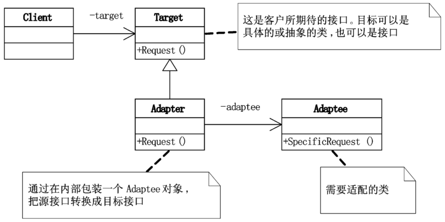

# 适配器模式

## 模式引入

### 问题描述

想象我们要出国旅游，到了异国他乡不懂当地语言怎么办？路上卯足马力突击学习？当然可以！不过更简单的做法是，打开手机翻译软件，切换到「当地语言-中文」就可以借助它与当地人进行对话了。这样，只要我们手机里有其他语言与中文的互译，就可以走遍地球任意一个角落并和当地人沟通了，而且我们自己并不需要真正掌握任何一门外语。

当然，有时候用翻译软件有点麻烦，有不准确的情况。此时，可以在当地找一个翻译，比如领导人出访国外时会带一个翻译，刚去 NBA 打球的姚明也随时有一个翻译在身边。

### 模式定义

这就是适配器模式，它一般在有满足需求功能的类，但接口不符合要求，或者希望创建一个可以复用的类，该类可以与其他不相关的类或不可预见的类协同工作时出现。总的来说，它的主要目的是希望能复用已有的类，但接口又与复用环境要求不一致。

适配器模式是将一个类的接口转换成客户希望的另外一个接口。使得原来接口不兼容的类可以一起工作。

### 问题分析

上面的例子中，中文与其他语言的互译器以及翻译人员就是适配器，我们自己或姚明就是那个已有的满足功能的类，接口和环境就是异国他乡。

## 模式介绍

### 解决方案

- 定义抽象类：`Player`，以及方法 `attact` 和 `defense`。
- 实现具体类：`Forwards`、`Center` 和 `Guards` 等，并重写抽象方法。
- 定义需要适配的类：`ForeignCenter`，他的方法和抽象类的不一样，需要适配。
- 使用适配器：`Translator` 将需要适配的 `ForeignCenter` 转换为 `Player`。

下面是一些注意事项：

- 一般在开发后期或维护期，双方都比较稳定、不太容易修改时候才会使用。

### 代码实现

`Target` 抽象类：

```java
public abstract class Player {
    protected String name;
    public Player(String name) {
        this.name = name;
    }

    public abstract void attack();
    public abstract void defense();
}
```

`Target` 具体类：

```java
public class Forwards extends Player {
    public Forwards(String name) {
        super(name);
    }

    @Override
    public void attack() {
        System.out.println("前锋 " + name + " 进攻");
    }

    @Override
    public void defense() {
        System.out.println("前锋 " + name + " 防守");
    }
}

public class Center extends Player {
    public Center(String name) {
        super(name);
    }

    @Override
    public void attack() {
        System.out.println("中锋 " + name + " 进攻");
    }

    @Override
    public void defense() {
        System.out.println("中锋 " + name + " 防守");
    }
}

public class Guards extends Player {
    public Guards(String name) {
        super(name);
    }

    @Override
    public void attack() {
        System.out.println("后卫 " + name + " 进攻");
    }

    @Override
    public void defense() {
        System.out.println("后卫 " + name + " 防守");
    }
}
```

`Adaptee` 类：

```java
public class ForeignCenter {
    private String name;
    public String getName() {
        return this.name;
    }

    public void setName(String name) {
        this.name = name;
    }

    public void attack() {
        System.out.println("外籍中锋 " + name + " 进攻");
    }

    public void defense() {
        System.out.println("外籍中锋 " + name + " 防守");
    }
}
```

`Adapter` 类：

```java
public class Translator extends Player {
    private ForeignCenter wjzf = new ForeignCenter();

    public Translator(String name) {
        super(name);
        wjzf.setName(name);
    }

    @Override
    public void attack() {
        wjzf.attack();
    }

    @Override
    public void defense() {
        wjzf.defense();
    }
}
```

`Main` 方法：

```java
public class Main {
    public static void main(String[] args) {
        Player b = new Forwards("巴蒂尔");
        b.attack();

        Player m = new Guards("麦克格雷迪");
        m.attack();

        Player ym = new Translator("姚明");
        ym.attack();
        ym.defense();
    }
}
```

执行结果：

```bash
前锋 巴蒂尔 进攻
后卫 麦克格雷迪 进攻
外籍中锋 姚明 进攻
外籍中锋 姚明 防守
```

### 结构组成



- Target：客户所期待的接口，可以是具体类、抽象类或接口。
- Adaptee：需要适配的类。
- Adapter：通过在内部包装一个 Adaptee 对象，把源接口转换为目标接口。

## 模式评价

### 适用场景

- 系统数据和行为正确，但接口不符时。比如上面姚明他听不懂英文的进攻和防守。
- 扩展新功能接入第三方接口时。

### 实际应用

实际中的例子：复用功能但接口不符，俗称包一层。

### 优点缺点

适配模式优点包括：

- 接口与业务逻辑解耦。Adapter 只要和 Target 对齐就行，Client 根本不关心 Adaptee 具体怎么和 Adapter 对接，它甚至不需要知道 Adaptee 的存在。
- 容易扩展。

适配模式缺点包括：

- 代码复杂度增加。

