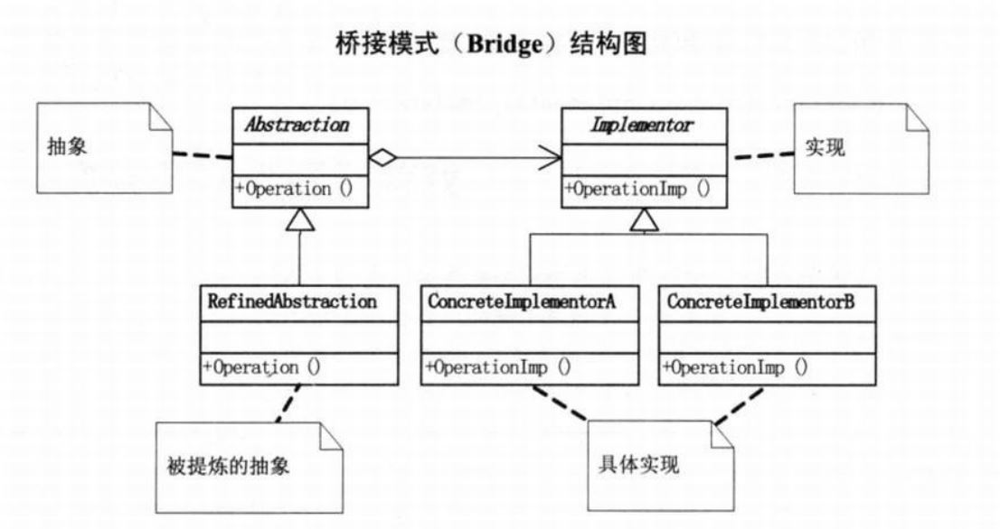

# 桥接模式

## 问题引入

### 问题描述

两个不同品牌的手机，需要具有各自的通讯录、游戏等功能。

### 问题分析

实现该目标的程序采用继承方式设计，那么父类和子类之间会具有非常紧密的依赖关系，父类中的任何变化都会影响子类，子类继承的实现如果无法解决新需求就必须重写或替换父类。如此设计会导致类爆炸问题，并且扩展不灵活。

### 解决方案

核心思想使用合成/聚合原则代替类继承思想设计程序，从而降低耦合度、减少代码量。

首先确定分类的角度，然后把这些实现独立出来，让它们互不干扰相互独立，从而减少耦合。需要注意的是能否找到合适的桥接点，如果没有就不必要非要使用桥接模式。

## 模式介绍

### **定义**

桥接模式是将抽象部分与其实现部分分离，使它们都可以独立地变化。

### **结构**

### 实现

**代码实现**

- C++ 实现：[链接](https://github.com/datawhalechina/sweetalk-design-pattern/src/design_patterns/cpp/bridge)
- Java 实现：[链接](https://github.com/datawhalechina/sweetalk-design-pattern/src/design_patterns/java/bridge)
- Python 实现：[链接](https://github.com/datawhalechina/sweetalk-design-pattern/src/design_patterns/python/bridge)

## 使用场景

**适合场景**

1.对于使用较多类继承问题而导致紧耦合、扩展性差的系统。

2.对于存在多个独立变化并需要灵活扩展维度的需求。

**实际应用**

1.JDBC 规范和不同数据库厂商驱动的实现

2.spring中可以根据客户的需求能够动态切换不同的数据源。

3.Nginx的模块架构就应用了桥接模式，使用了nginx_module_t定义模块，结构体里有若干函数指针和扩展字段，然后桥接实现了丰富多彩的core、conf、event、stream、http等功能模块，搭建起整个Nginx框架。

## 模式评价

**模式优点**

1.避免了继承导致的类爆炸问题

2.具备灵活的可扩展性

**不足之处**

将抽象和实现分类会增加设计的难度

