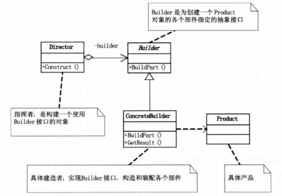
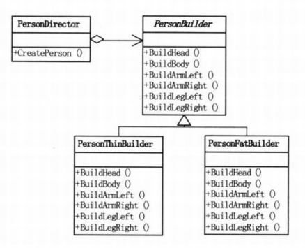

# 建造者模式

## 1 问题引入
&emsp;&emsp;用程序画一个小人，要求小人有头、身体、两手和两脚。

### 1.1 问题描述

&emsp;&emsp;不能缺胳膊少腿。

### 1.2 问题分析
- 构造小人的过程是稳定的，都需要头身手脚；
- 具体建造的"细节"不同，有高矮胖瘦。

### 1.3 解决方案
1. 定义抽象的**建造人**的类，里面有构建头身手脚的抽象方法；
2. 建造具体的小人，去继承上面的抽象类，重写抽象方法；
3. 创建一个**指挥者**，控制构建过程，隔离用户与构造过程的关联。

### 1.4 代码实现

* C++语言实现：[链接]("https://github.com/datawhalechina/sweetalk-design-pattern/src/design_patterns/cpp/builder/")
* Java语言实现：[链接]("https://github.com/datawhalechina/sweetalk-design-pattern/src/design_patterns/java/builder/")
* python语言实现：[链接]("https://github.com/datawhalechina/sweetalk-design-pattern/src/design_patterns/python/builder/Builder.py")
* C#语言实现见原书第二版。

## 2 模式介绍

### 2.1 定义
&emsp;&emsp;`建造者模式(Builder)`，将一个复杂对象的构建与它的表现分离，使得同样的构建过程可创建不同的表示。建造者模式属于创建型模式。
- 建造者：创建和提供实例；
- 导演：管理建造出来的实例间的依赖关系。

> 与工厂模式的区别：建造者模式更关注与零件装配的顺序

### 2.2 结构

以上述问题为例，结构如下

## 3 适用场景

一些基础部件不变，而其组合经常变化。

**应用实例**
- 去肯德基，汉堡、可乐、薯条、炸鸡翅等是不变的，而其组合是经常变化的，生成出所谓的"套餐"；
- JAVA中的StringBuilder

## 4 评价
### 4.1 优点
- 建造者独立，易扩展
- 便于控制细节风险

### 4.2 缺点
- 产品必须有共同点，范围有限制
- 如内部变化复杂，会有很多的建造类

## 5 参考资料
[建造者模式 - 菜鸟教程](https://www.runoob.com/design-pattern/builder-pattern.html)

