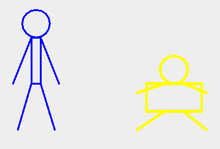

# 建造者模式

## 模式引入

### 问题描述

设想我们要用程序画一个小人，要求小人有头、身体、两手和两脚。我们可以简单地用画笔，指定小人的坐标。如果增加需求，画一个身体比较胖的小人，我们可以重新调整坐标实现。上面这种简单的画法，很容易缺胳膊少腿。

我们仔细思考一下，可以发现：建造小人的**过程是稳定**的（都需要头身手脚），而具体建造的**细节是不同**的，有高矮胖瘦。

### 模式定义

当我们需要将一个复杂对象的构建与它的表现分离，使得同样的构建过程可以创建不同的表示时，就可以用到`建造者模式(Builder)`。

建造者模式又叫生成器模式，属于创建型模式。当我们使用建造者模式时，用户只需指定需要建造的类型即可得到它们，而无需知道具体建造的过程和细节。

- 建造者：创建和提供实例；
- 导演：管理建造出来的实例间的依赖关系。

> 与工厂模式的区别：建造者模式更关注与零件装配的顺序

### 问题分析

- 构造小人的过程是稳定的，都需要头身手脚；

- 具体建造的"细节"不同，有高矮胖瘦。

## 模式介绍

### 解决方案

1. 先定义一个抽象的**建造人**的类，把这个过程稳定住，里面有构建头身手脚的抽象方法；
2. 然后建造具体的小人，去继承上面的抽象类；
3. 创建一个**指挥者**，用它来控制构建过程，隔离用户与构造过程的关联。

下面是一些注意事项：

- 继承抽象类时，记得重写抽象方法

### 代码实现

`PersonBuilder` 抽象类：

```java
import java.awt.*;

public abstract class PersonBuilder {
    protected Graphics2D g;
    protected Pen p;

    public PersonBuilder(Graphics2D g, Pen p) {
        g.setStroke(new BasicStroke(p.getLineWidth()));
        g.setColor(p.getColor());
        this.g = g;
        this.p = p;
    }

    public abstract void buildHead();
    public abstract void buildBody();
    public abstract void buildArmLeft();
    public abstract void buildArmRight();
    public abstract void buildLegLeft();
    public abstract void buildLegRight();
}
```

`PersonFatBuilder` 具体类：

```java
import java.awt.*;

public class PersonFatBuilder extends PersonBuilder {
    public PersonFatBuilder(Graphics2D g, Pen p) {
        super(g, p);
    }

    @Override
    public void buildHead() {
        g.drawOval(200, 70, 30, 30);
    }

    @Override
    public void buildBody() {
        g.drawRect(185, 100, 60, 30);
    }

    @Override
    public void buildArmLeft() {
        g.drawLine(205, 100, 175, 110);
    }

    @Override
    public void buildArmRight() {
        g.drawLine(225, 100, 250, 110);
    }

    @Override
    public void buildLegLeft() {
        g.drawLine(205, 130, 175, 150);
    }

    @Override
    public void buildLegRight() {
        g.drawLine(225, 130, 250, 150);
    }
}
```

`PersonThinBuilder` 具体类：

```java
import java.awt.*;

public class PersonThinBuilder extends PersonBuilder {
    public PersonThinBuilder(Graphics2D g, Pen p) {
        super(g, p);
    }

    @Override
    public void buildHead() {
        g.drawOval(50, 20, 30, 30);
    }

    @Override
    public void buildBody() {
        g.drawRect(60, 50, 10, 50);
    }

    @Override
    public void buildArmLeft() {
        g.drawLine(60, 50, 40, 100);
    }

    @Override
    public void buildArmRight() {
        g.drawLine(70, 50, 90, 100);
    }

    @Override
    public void buildLegLeft() {
        g.drawLine(60, 100, 45, 150);
    }

    @Override
    public void buildLegRight() {
        g.drawLine(70, 100, 85, 150);
    }
}
```

`PersonDirector` 类：

```java
public class PersonDirector {

    private PersonBuilder pb;

    public PersonDirector(PersonBuilder pb) {
        this.pb = pb;
    }

    public void createPerson() {
        pb.buildHead();
        pb.buildBody();
        pb.buildArmLeft();
        pb.buildArmRight();
        pb.buildLegLeft();
        pb.buildLegRight();
    }
}
```

`Pen` 类：

```java
import java.awt.*;

public class Pen {
    private int lineWidth;
    private Color color;

    public Pen(int lineWidth, Color color) {
        this.lineWidth = lineWidth;
        this.color = color;
    }

    public int getLineWidth(){
        return lineWidth;
    }

    public Color getColor(){
        return color;
    }
}
```

`BuilderMain` 方法：

```java
import javax.swing.*;
import java.awt.*;

public class BuilderMain {
    public static void main(String[] args) {
        JFrame jFrame = new JFrame();

        JPanel jpanel = new JPanel() {
            @Override
            public void paint(Graphics graphics) {
                super.paint(graphics);
                PersonBuilder ptb = new PersonThinBuilder((Graphics2D) graphics, new Pen(2, Color.BLUE));
                PersonDirector pd = new PersonDirector(ptb);
                pd.createPerson();
                PersonBuilder pfb = new PersonFatBuilder((Graphics2D) graphics, new Pen(3, Color.YELLOW));
                pd = new PersonDirector(pfb);
                pd.createPerson();
            }
        };

        jFrame.add(jpanel);
        jFrame.setSize(300, 300);
        jFrame.setVisible(true);
        jFrame.setDefaultCloseOperation(JFrame.EXIT_ON_CLOSE);
    }
}
```

执行结果：



### 结构组成


- Director：指挥者，根据用户需求构建小人对象；
- Builder：构造小人各个部分的抽象类；
- ConcreteBuilder：具体的小人，具体实现如何画出小人的头身手脚各个部分；
- Product：具体的产品小人。

## 模式评价

### 适用场景

- 创建一些复杂的对象，这些对象内部构建间的建造顺序通常是稳定的，但对象内部的构建通常面临着复杂的变化；
- 一些基础部件不变，而其组合经常变化。

### 实际应用

- JAVA中的StringBuilder
- 去肯德基，汉堡、可乐、薯条、炸鸡翅等是不变的，而其组合是经常变化的，生成出所谓的"套餐"；

### 优点缺点

优点：

- 使得建造代码与表示代码分离，易扩展
- 便于控制细节风险

缺点：

- 产品必须有共同点，范围有限制
- 如内部变化复杂，会有很多的建造类