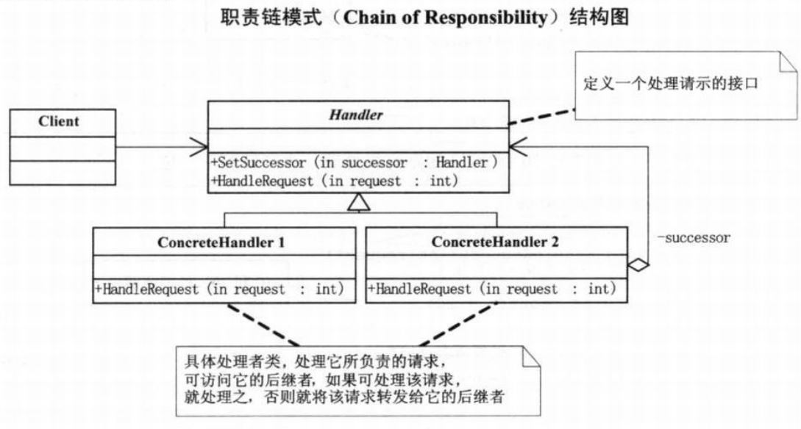

# 职责链模式

## 模式引入

### 问题描述

加薪、请假申请等需要层层审批的场景。比如向经理提加薪申请，经理没权利然后向总监上报，总监没权限然后向总经理汇报等。

### **模式定义**

职责链模式核心是解决服务中先后执行处理关系，从而降低请求发送者和接受者之间的耦合关系。类似于击鼓传花。

### 问题分析

如果将管理者创建成为一个类，那么该类会具有太多的责任，比如经理、总监以及总经理的审批和上报功能，就违背了单一职责原则。而且以后的需求可能会增加新的管理类别，比如项目经理、部门经理、人事总监等，那么就势必会修改管理者类以完成扩展，就违背了开放封闭原则。

## 模式实现

### 解决方案

将公司管理者的类别变成管理者的子类，可以通过多态性来化解分支带来的僵化。然后通过不同管理者之间建立管理关系实现请求的传递，使得请求的发送者和接收者解耦，可以让各服务模块更加清晰。处理者负责处理请求，客户只需要将请求发送到职责链，无需关心具体的处理细节。

Handler(请求类)：用于定义一个处理请示的接口。

ConcreteHandler(具体处理者类)：处理它所负责的请求，可访问它的后继者，如果能够处理就处理，否则就将请求转发给它的后继者。

### 代码实现

`Request` 类：

```java
public class Request {
    private String requestType;
    private String requestContent;
    private int number;

    public String getRequestType() {
        return requestType;
    }

    public void setRequestType(String requestType) {
        this.requestType = requestType;
    }

    public String getRequestContent() {
        return requestContent;
    }

    public void setRequestContent(String requestContent) {
        this.requestContent = requestContent;
    }

    public int getNumber() {
        return number;
    }

    public void setNumber(int number) {
        this.number = number;
    }
}
```

`Manager` 类：

```java
public abstract class Manager {
    protected String name;
    protected Manager superior;

    protected Manager(String name) {
        this.name = name;
    }

    public void SetSuperior(Manager superior) {
        this.superior = superior;
    }

    public abstract void requestApplications(Request request);
}
```

`ConcreteManager` 类：

```java
public class GeneralManager extends Manager {
    protected GeneralManager(String name) {
        super(name);
    }

    @Override
    public void requestApplications(Request request) {
        if(request.getRequestType() == "请假"){
            System.out.println(name + "：" + request.getRequestContent() + " 数量" + request.getNumber() + " 被批准" );
        }else if(request.getRequestType() == "加薪" && request.getNumber() <= 500) {
            System.out.println(name + "：" + request.getRequestContent() + " 数量" + request.getNumber() + " 被批准" );
        }else {
            System.out.println(name + "：" + request.getRequestContent() + " 数量" + request.getNumber() + " 再说吧" );
        }
    }
}

public class MajorDemo extends Manager {
    protected MajorDemo(String name) {
        super(name);
    }

    @Override
    public void requestApplications(Request request) {
        if(request.getRequestType() == "请假" && request.getNumber() <= 5) {
            System.out.println(name + "：" + request.getRequestContent() + " 数量" + request.getNumber() + " 被批准" );
        }else {
            if(superior != null) {
                superior.requestApplications(request);
            }
        }
    }
}

public class CommonManager extends Manager {
    protected CommonManager(String name) {
        super(name);
    }

    @Override
    public void requestApplications(Request request) {
        if(request.getRequestType() == "请假" && request.getNumber() <= 2) {
            System.out.println(name + "：" + request.getRequestContent() + " 数量" + request.getNumber() + " 被批准" );
        }else {
            if(superior != null) {
                superior.requestApplications(request);
            }
        }
    }
}
```

`Main` 方法：

```java
public class Main {
    public static void main(String[] args) {
        CommonManager jinli = new CommonManager("金利");
        MajorDemo zongjian = new MajorDemo("宗剑");
        GeneralManager zhongjingli = new GeneralManager("钟精励");
        jinli.SetSuperior(zongjian);
        zongjian.SetSuperior(zhongjingli);

        Request request = new Request();
        request.setRequestType("请假");
        request.setRequestContent("小菜请假");
        request.setNumber(1);
        jinli.requestApplications(request);

        Request request2 = new Request();
        request2.setRequestType("请假");
        request2.setRequestContent("小菜请假");
        request2.setNumber(4);
        jinli.requestApplications(request2);

        Request request3 = new Request();
        request3.setRequestType("加薪");
        request3.setRequestContent("小菜请求加薪");
        request3.setNumber(500);
        jinli.requestApplications(request3);

        Request request4 = new Request();
        request4.setRequestType("加薪");
        request4.setRequestContent("小菜请求加薪");
        request4.setNumber(1000);
        jinli.requestApplications(request4);
    }
}
```

执行结果：

```bash
金利：小菜请假 数量1 被批准
宗剑：小菜请假 数量4 被批准
钟精励：小菜请求加薪 数量500 被批准
钟精励：小菜请求加薪 数量1000 再说吧
```

### 结构组成



## 模式评价

### 适用场景

一个请求有多个对象可以处理，但每个对象的处理条件或权限不同。

### 实际应用

- Netty 中 Pipeline 与 ChannelHandler 通过责任链来组织代码逻辑。
- Tomcat 中 Servlet 过滤器使用了责任链模式。
- Spring 中切面编程和安全机制都使用了责任链模式。

### 优点缺点

模式优点：

- 能够简化对象的相互连接，接收者和发送者都没有对方的明确信息，且链中的对象也不知道链的结构。
- 避免了请求的发送者和接受者之间的耦合关系。
- 能够随时修改请求的结构，增强了给对象指派职责的灵活性

模式缺点：

- 请求可能到了链的末端都得不到处理，或者因为没有正确配置得不到处理。
- 较长的责任链可能会影响到系统的性能。


