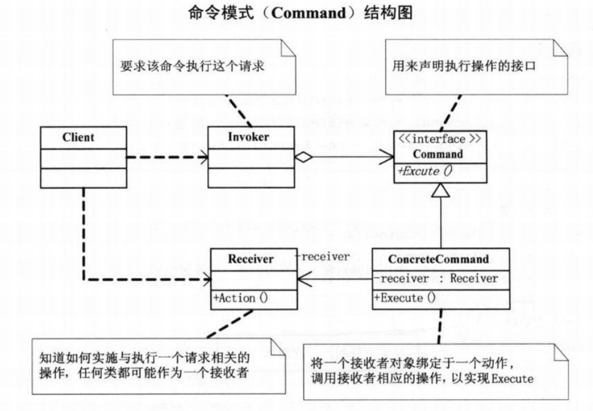

# 命令模式

## 问题引入

### 问题描述

对于烧烤摊场景，由于客户和烤肉串老板的紧耦合所以容易出错，也容易挑剔。可以通过引入服务员完成点菜等请求排队以及退单等可撤销的操作之类的行为，实现客户和烤肉串老板的关系解耦。

### **模式定义**

将请求封装为命令对象，通过数据驱动的方式将命令对象用构造函数的方式传递给调用者，调用者再根据具体的实现执行相应的命令。顺序：调用者→命令→接受者。

### 问题分析

在系统中行为请求请求者和行为实现者通常是紧耦合的，对于请求排队或记录请求日志，以及支持可撤销的操作等行为，这种紧耦合不合适。

## 模式介绍

### 解决方案

将调用操作的请求对象与实现操作的接受对象解耦，顺序为调用者->命令->接受者。

Command(抽象命令类)，用来声明执行操作的接口。

ConcreteCommond(命令实现类)，命令的具体实现，将接收者对象与动作绑定，从而调用接收者相应的操作完成命令。

Invoker(调用者)，调用命令实现某个请求。

Receive(接收者)，实施与执行与请求相关的操作。

### 代码实现

```java
public abstract class Command {
    protected Barbecuer receiver;

    public Command(Barbecuer receiver) {
        this.receiver = receiver;
    }

    public abstract void excuteCommand();
}

public class BakeChickenWingCommand extends Command {
    public BakeChickenWingCommand(Barbecuer receiver) {
        super(receiver);
    }

    @Override
    public void excuteCommand() {
        receiver.bakeChickenWing();
    }
}

public class BakeMuttonCommand extends Command {
    public BakeMuttonCommand(Barbecuer receiver) {
        super(receiver);
    }

    @Override
    public void excuteCommand() {
        receiver.bakeMutton();
    }
}

public class Waiter {
    private List<Command> orders = new ArrayList<>();

    public void setOrder(Command command) {
        if (command.getClass().toString().equals("class design_patterns.java.command.BakeChickenWingCommand")) {
            System.out.println("服务员：鸡翅没有了，请点别的烧烤。");
        }else {
            orders.add(command);
            System.out.print("增加订单：" + command.getClass().toString());
            System.out.println(" 时间：" + new Date());
        }
    }

    public void cancelOrder(Command command) {
        orders.remove(command);
        System.out.print("取消订单：" + command.getClass().toString());
        System.out.println(" 时间：" + new Date());
    }

    public void excute() {
        for(Command cmd : orders){
            cmd.excuteCommand();
        }
    }
}

public class Barbecuer {
    public void bakeMutton() {
        System.out.println("烤羊肉串！");
    }

    public void bakeChickenWing() {
        System.out.println("烤鸡翅！");
    }
}

public class Main {
    public static void main(String[] args) {
        // 开店前的准备
        Barbecuer boy = new Barbecuer();
        Command bakeMuttonCommand1 = new BakeMuttonCommand(boy);
        Command bakeMuttonCommand2 = new BakeMuttonCommand(boy);
        Command bakeChickenWingCommand1 = new BakeChickenWingCommand(boy);
        Waiter girl = new Waiter();

        // 开门营业
        girl.setOrder(bakeMuttonCommand1);
        girl.setOrder(bakeMuttonCommand2);
        girl.setOrder(bakeChickenWingCommand1);
        girl.excute();
    }
}


```

### **结构**组成



## 模式评价

**适合场景**

所有能当作命令的场景下都可以考虑使用命令模式

**实际应用**

1.Spring 框架的 JdbcTemplate 

2.JDK中的Runnable接口的运用

**模式优点**

通过分离调用者和请求者降低系统的耦合度，可扩展性强。

**模式缺点**

导致出现过多的命令类。

