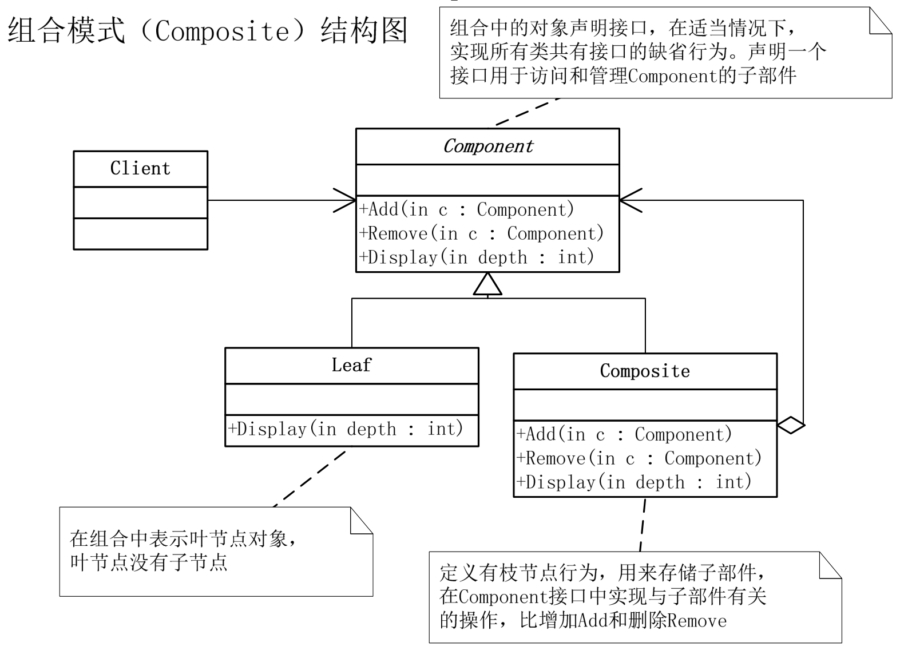

# 组合模式

## 设计动机

**问题引入**

假设我们要给一家公司做一个 OA 系统，公司总部在北京，全国几个大城市都有子公司，其他一些省会城市是办事处，有些城市还设置了大区。总部有职能部门，各个子公司也有自己的职能部门。这是一个明显的树状结构，最简单的想法是针对不同类型（如公司或部门）组织创建不同的对象，组织之间的交互在其内部实现。但是这样有不少问题，比如无法体现公司的组织结构，交互的实现复杂混乱，新增类型时工作量巨大等等。而且对用户来说，这不同类型其实是类似的——都是组织。

**模式引入**

像刚刚这种具有层级结构，且组成对象具有一致性的情况，就适合使用组合模式。在上面的例子中，总部是根节点，下面有各个职能部门以及与其平行的子公司，每个子公司下面又有自己的职能部门。

## 模式介绍

**模式定义**

组合模式（Composite）是将对象组合成树形结构以表示 “部分-整体” 的层次结构，组合模式使得用户对单个对象和组合对象的使用具有一致性。

**模式结构**

组合模式主要包括三个对象，分别是Component（对象接口）、Composite（枝节点）和 Leaf（叶节点）
- Component（对象接口）：主要实现所有类共有接口的默认行为，声明一个接口，用于访问和管理 Component 的子部件
- Composite（枝节点）：定义枝节点行为，用于存储子部件，在 Component 接口中实现与子部件有关的操作，比如增加（Add）和删除（Remove）
- Leaf（叶节点）：表示叶节点对象，叶节点没有子节点

**代码实现**

- C++ 实现：[链接](https://github.com/datawhalechina/sweetalk-design-pattern/tree/main/src/design_patterns/cpp/composite)
- Java 实现：[链接](https://github.com/datawhalechina/sweetalk-design-pattern/tree/main/src/design_patterns/java/composite)
- Python 实现：[链接](https://github.com/datawhalechina/sweetalk-design-pattern/tree/main/src/design_patterns/python/composite)

## 使用场景

**适合场景**

- 体现部分与整体层次的结构时。
- 希望用户忽略组合对象与单个对象的不同，统一使用组合结构中的所有对象时。

**实际应用**

- 公司管理系统。
- 文件系统。
- 编译器。

## 模式评价

**模式优点**

- 让用户可以一致地使用组合结构和对象。
- 组合对象可以自由增删组件，灵活组合不同对象。

**不足之处**

- 层级太深时结构会变得庞杂。
