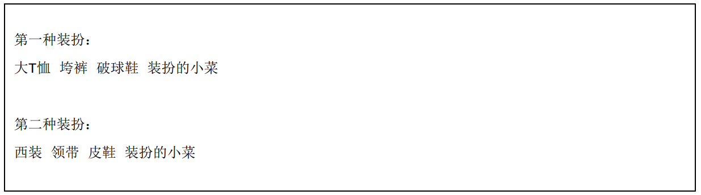
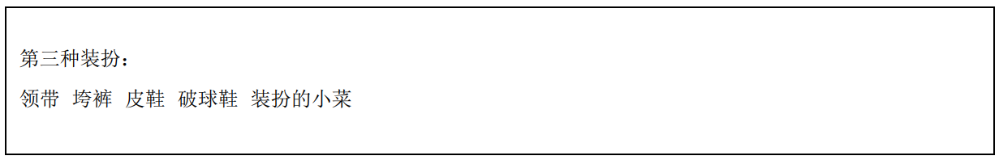
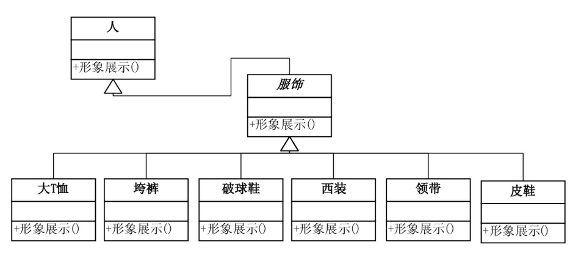
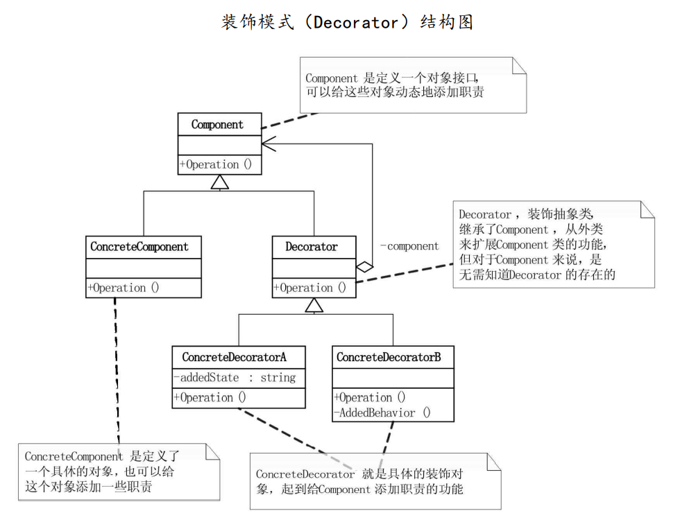

# 装饰模式

## 问题引入

### 问题描述

想要给人一个较好的印象，穿衣搭配得体干净是不可或缺的。我们可以使用程序写一个可以给人搭配不同服饰的系统，比如类似QQ、电商平台或游戏都有的Avatar系统，实现给人搭配嘻哈服或白领装的功能。程序预期的输出效果如下图所示。



为实现这一程序，可先定义Person类，将服饰装扮都写为Person类的接口方法。但如若要在此基础上增加“超人”的装扮，就需要修改Person类，会违背开放-封闭原则，因此应考虑将服饰单独为类。



同时，由于穿衣过程不能在众目睽睽之下完成，应当考虑在类内部组装完毕，再显示。而类内部的服饰组装过程不是固定的，因为通过服饰组合出一个有个性的人完全可以有无数种方案，如上衣大T恤，既可以搭配球鞋，也可以搭配皮鞋。同时服饰的装扮的先后顺序也有一定讲究，毕竟先穿内裤后穿外裤和先穿外裤再穿内裤是截然不同的效果。也就是说，我们需要将所需功能按正确的顺序串联起来进行控制，此时可以考虑使用`装饰模式`。

### 模式定义

`装饰模式（Decorator Pattern）`是指创建一个装饰类，来包装原有的类，从而实现动态地向一个现有的对象添加一些额外的职责，同时不改变其原有的结构。`装饰模式`比生成子类更为灵活。

### 问题分析

`装饰模式`用在此问题较为直观，衣服、鞋子、领带、披风等服饰都可以理解为对人的装饰。在实现Person类表示人的基础上，定义具体的服饰类实现对Person类进行服装装饰，装扮完再统一显示，这样既避免了穿每一件衣服的过程直接在客户端实现，同时又保留服装搭配的灵活性。

## 模式实现

### 解决方案

使用`装饰模式`来解决问题。
1. 创建抽象的接口类`Component`，定义给对象动态添加职责的公共接口（在此例中，由于具体的接口只有一个，所以该步也可省略）；
2. 创建具体的接口`Person`(Concrete Component)，继承于抽象接口类`Component`，同时：    
    * 定义方法`Show()`用于显示装扮结果；
3. 创建抽象的装饰类`Finery`（Decorator），继承于接口类`Person`（一般来说继承于抽象接口类`Component`，由于此例只有一个接口，故继承于具体接口类），同时：    
    * 定义方法`Decorate(component)`用于进行装扮过程；
    * 覆写`Show()`具体装扮结果的显示；
4. 创建系列具体的服饰类（Concrete Decorator），如`Tshirts`，`BigTrouser`等，继承于抽象装饰类`Finery`，实现具体的装饰对象，同时：    
    * 覆写`Show()`具体装扮结果的显示。

### 代码实现

*此处我们使用Java语言来实现这一方案，C#语言实现可见原书原版，本项目的所有语言实现可见本项目Github仓库，其中包括：[C++](https://github.com/datawhalechina/sweetalk-design-pattern/tree/main/src/design_patterns/cpp/decorator/)，[Java](https://github.com/datawhalechina/sweetalk-design-pattern/tree/main/src/design_patterns/java/decorator/example)，[python](https://github.com/datawhalechina/sweetalk-design-pattern/tree/main/src/design_patterns/python/decorator/DecoratorFinery.py)，读者可按需参阅。*

定义`Person`类，相当于`ConcreteComponent`。

```Java
public class Person {
    public Person() {}

    private String name;
    public Person(String name) {
        this.name = name;
    }

    public void show() {
        System.out.println("装扮的" + this.name);
    }
}
```

定义`Finery`类，相当于`Decorator`。

```Java
public class Finery extends Person {
    protected Person component;

    public void decorate(Person component) {
        this.component = component;
    }

    @Override
    public void show() {
        if(component != null) {
            component.show();
        }
    }
}
```

具体的服饰类，相当于`ConcreteDecorator`，这里以Tshirts、Sneakers、BigTrouser为例，其余类类似，代码省略。
```Java
public class TShirts extends Finery{
    @Override
    public void show() {
        System.out.println("大T恤");
        super.show();
    }
}

public class Sneakers extends Finery{
    @Override
    public void show() {
        System.out.println("运动鞋");
        super.show();
    }
}

public class BigTrouser extends Finery{
    @Override
    public void show() {
        System.out.println("跨裤");
        super.show();
    }
}
```

客户端如下。

```Java
public class DecoratorClient {
    public static void main(String[] args) {
        Person person = new Person("小菜");
        System.out.println("第一种装扮:");

        Sneakers sneaker = new Sneakers();
        BigTrouser trouser = new BigTrouser();
        TShirts tshirt = new TShirts();
        
        sneaker.decorate(person);
        trouser.decorate(sneaker);
        tshirt.decorate(trouser);
        tshirt.show();
    }
}
```

运行结果如下。
```
第一种装扮：
大T恤
垮裤
破球鞋
装扮的小菜
```

### 结构组成

装饰模式由四类主要角色组成：
 1. 实体接口：对象接口的定义，可以为对象动态添加职责，在这个例子中职责具体为形象展示的过程，由于Person类在此程序中只有形象展示这一个职责，Person类既是访问接口，也是实体类；
 2. 实体类：在这个例子中具体为Person类；
 3. 装饰抽象类：继承实体接口，动态扩展其职责，在这个例子中具体为服饰抽象类；
 3. 具体装饰类：装饰的具体实现，在这个例子中具体为各类服饰类，如大T恤，大垮裤等。

结构示意图如下



装饰模式的通用结构示意图如下



## 模式评价

### 适用场景

可以在不生成很多子类的情况下扩展类，适用于扩展类需求较多，而又不想引起子类膨胀的场景。

### 实际应用

* 通知信息有多种渠道，如通过短信、微信、QQ、邮件等。不同的信息会采用不同的多种渠道组合进行通知，此时若对每一个组合都建立子类，会造成子类数量爆炸，可以考虑装饰器模式。

### 优点缺点

装饰模式的优点有

* 把类中的装饰功能从类中搬移去除，很好地简化了原有的类；
* 有效地把类的核心职责和装饰功能区分开了，可以去除相关类中重复的装饰逻辑；
* 装饰类和被装饰类可以独立发展，不会相互耦合；
* 无需创建新子类即可实现对类功能的动态扩展；
* 支持运行时添加或删除对象的功能；
* 满足“单一职责原则”，可将实现许多不同行为的类拆分为多个较小的类。

装饰模式的缺点有

* 在封装器栈中删除特定封装器比较困难；
* 较难实现行为不受到先后顺序影响的装饰；
* 各装饰层的代码相对冗余。

## 参考资料
1. 《深入设计模式》