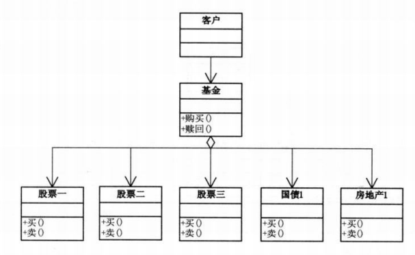

# 外观模式

## 模式引入

### 问题描述

股民炒股投资：股票种类有股票、国债、房产等，操作包含买和卖。

### 模式定义

`外观模式（Facade）`，为子系统中的一组接口提供了一个一致的界面，此模式定义了一个高层接口，使得子系统更容易使用。外观模式属于结构型模式。

- 在客户端和复杂系统间加了一层，这一层将调用顺序、依赖关系等处理好；

- 隐藏了系统的复杂性，向客户端提供了一个可访问系统的接口。

### 问题分析

1. 用户与众多股票的联系太多，不利于操作，耦合性过高；
2. 设置基金类，用户只需跟基金打交道，关心基金的涨跌即可。

## 模式介绍

### 解决方案

1. 创建基金类，涵盖所有股票的方法或属性，进行组合，方便外界调用；
2. 客户端调用，只需调用基金。

### 代码实现

`Stock1` 抽象类：

```java
public class Stock1 {
    public void sell() {
        System.out.println("股票1卖出");
    }

    public void buy() {
        System.out.println("股票1买入");
    }
}
```

`Stock2` 具体类：

```java
public class Stock2 {
    public void sell() {
        System.out.println("股票2卖出");
    }

    public void buy() {
        System.out.println("股票2买入");
    }
}
```

`Stock3` 具体类：

```
public class Stock3 {
    public void sell() {
        System.out.println("股票3卖出");
    }

    public void buy() {
        System.out.println("股票3买入");
    }
}
```

`Realty1` 类：

```java
public class Realty1 {
    public void sell() {
        System.out.println("房地产1卖出");
      }

    public void buy() {
        System.out.println("房地产1买入");
    }
}
```

`NationalDebt1` 类：

```java
public class NationalDebt1 {
    public void sell() {
        System.out.println("国债1卖出");
      }

    public void buy() {
        System.out.println("国债1买入");
    }
}

```

`Fund` 类：
```java
public class Fund {
    private Stock1 gu1;
    private Stock2 gu2;
    private Stock3 gu3;
    private NationalDebt1 nd1;
    private Realty1 rt1;

    public Fund() {
        gu1 = new Stock1();
        gu2 = new Stock2();
        gu3 = new Stock3();
        nd1 = new NationalDebt1();
        rt1 = new Realty1();
    }

    public void buyFund() {
        gu1.buy();
        gu2.buy();
        gu3.buy();
        nd1.buy();
        rt1.buy();
    }

    public void sellFund() {
        gu1.sell();
        gu2.sell();
        gu3.sell();
        nd1.sell();
        rt1.sell();
    }
}
```

`FacadeMain` 方法：

```java
public class FacadeMain {
    public static void main(String[] args) {
        Fund fund = new Fund();
        fund.buyFund();
        fund.sellFund();
    }
}
```

执行结果：

```bash
股票1买入
股票2买入
股票3买入
国债1买入
房地产1买入
股票1卖出
股票2卖出
股票3卖出
国债1卖出
房地产1卖出
```

### 结构组成

外观类，需要了解所有子系统的方法或属性，进行组合，以便外界调用。


以上述问题为例，结构如下



## 模式评价

### 适用场景

客户端不需要知道系统内部的复杂联系，整个系统只需提供一个"接待员"即可。
- 在设计初期，在层与层直接建立外观模式；
- 在开发阶段，子系统经常因为不断的重构变得更复杂。外观模式可以提供加简单的接口，方便外部调用；
- 在维护遗留的大系统时，为新系统开发一个外观模式，让新系统与Facade对象交互，Facade与遗留代码交互。

### 实际应用

- 医院看病，挂号、门诊、划价、取药，让患者觉得很复杂。设有接待人员，就很方便；
- 三层开发模式。

### 优点缺点

优点：

- 减少系统相互依赖
- 提高了灵活性
- 提高了安全性

缺点：

不符合开闭原则，如果要改东西很麻烦，继承重写都不合适。