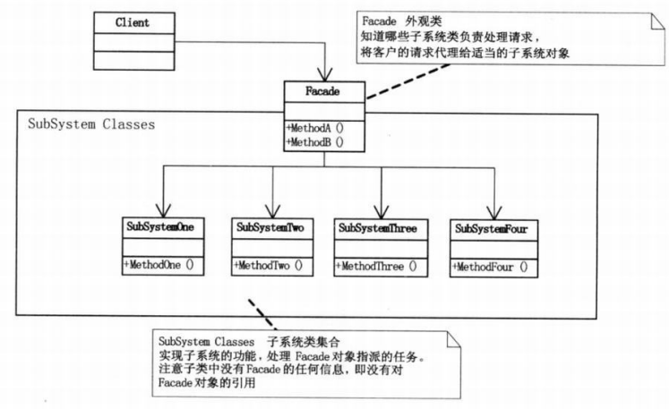

# 外观模式

## 模式引入

### 问题描述

新手开始炒股，是很容易亏钱的。因为要了解的知识很多，刚开始心态也很不稳定。此时，基金是一个很好的帮手，它将投资者分散的基金集中起来，交给专业的经理人管理和投资。

我们进一步分析可以发现：投资者与众多股票的联系太多，耦合性过高，反而不利于操作。而有了基金后，投资者只需和基金打交道，降低了耦合性。

### 模式定义

`外观模式（Facade）`，为子系统中的一组接口提供了一个一致的界面。此模式定义了一个高层接口，这个接口使得子系统更容易使用。

外观模式属于结构型模式。

- 外观模式在客户端和复杂系统间加了一层，这一层负责处理调用顺序和依赖关系等；

- 外观模式隐藏了系统的复杂性，向客户端提供了一个可访问系统的接口。

### 问题分析

- 用户与众多股票的联系太多，不利于操作，耦合性过高；
- 设置基金类，用户只需跟基金打交道，关心基金的涨跌即可。

## 模式介绍

### 解决方案

- 创建基金类。基金类需要了解所有股票的方法或属性，进行组合，方便外界调用；
- 在客户端调用时，不需要了解股票，只需调用基金。

### 代码实现

股票1的具体类：
```java
public class Stock1 {
    public void sell() {
        System.out.println("股票1卖出");
    }

    public void buy() {
        System.out.println("股票1买入");
    }
}
```

股票2的具体类：
```java
public class Stock2 {
    public void sell() {
        System.out.println("股票2卖出");
    }

    public void buy() {
        System.out.println("股票2买入");
    }
}
```

股票3的具体类
```java
public class Stock3 {
    public void sell() {
        System.out.println("股票3卖出");
    }

    public void buy() {
        System.out.println("股票3买入");
    }
}
```

房地产的具体类：
```java
public class Realty1 {
    public void sell() {
        System.out.println("房地产1卖出");
      }

    public void buy() {
        System.out.println("房地产1买入");
    }
}
```

国债1的具体类：
```java
public class NationalDebt1 {
    public void sell() {
        System.out.println("国债1卖出");
      }

    public void buy() {
        System.out.println("国债1买入");
    }
}
```

基金类：
```java
public class Fund {
    private Stock1 gu1;
    private Stock2 gu2;
    private Stock3 gu3;
    private NationalDebt1 nd1;
    private Realty1 rt1;

    public Fund() {
        gu1 = new Stock1();
        gu2 = new Stock2();
        gu3 = new Stock3();
        nd1 = new NationalDebt1();
        rt1 = new Realty1();
    }

    public void buyFund() {
        gu1.buy();
        gu2.buy();
        gu3.buy();
        nd1.buy();
        rt1.buy();
    }

    public void sellFund() {
        gu1.sell();
        gu2.sell();
        gu3.sell();
        nd1.sell();
        rt1.sell();
    }
}
```

客户端方法：
```java
public class FacadeMain {
    public static void main(String[] args) {
        Fund fund = new Fund();
        fund.buyFund();
        fund.sellFund();
    }
}
```

执行结果：

```bash
股票1买入
股票2买入
股票3买入
国债1买入
房地产1买入
股票1卖出
股票2卖出
股票3卖出
国债1卖出
房地产1卖出
```

### 结构组成

外观类，需要了解所有子系统的方法或属性，进行组合，以便外界调用。



- SubSystem: 子系统的类；
- Facade：外观类，需要了解所有子系统的方法或属性，进行组合，以备外界调用；
- Client：客户端调用。由于Facade的存在，客户端不需要知道三个子系统类的存在。

## 模式评价

### 适用场景

客户端不需要知道系统内部的复杂联系，整个系统只需提供一个"接待员"即可。

### 实际应用
- 三层开发模式
    - 设计初期，在层与层直接建立外观模式；
    - 开发阶段，子系统经常因为不断的重构变得更复杂。外观模式可以提供加简单的接口，方便外部调用；
    - 维护遗留的大系统时，为新系统开发一个外观模式，让新系统与Facade对象交互，Facade与遗留代码交互。
- 医院看病，挂号、门诊、划价、取药，让患者觉得很复杂。设有接待人员，就很方便。

### 优点缺点

优点：

- 减少了系统间的相互依赖
- 提高了灵活性

缺点：

不符合开闭原则。如果要改东西很麻烦，继承和重写都不合适。