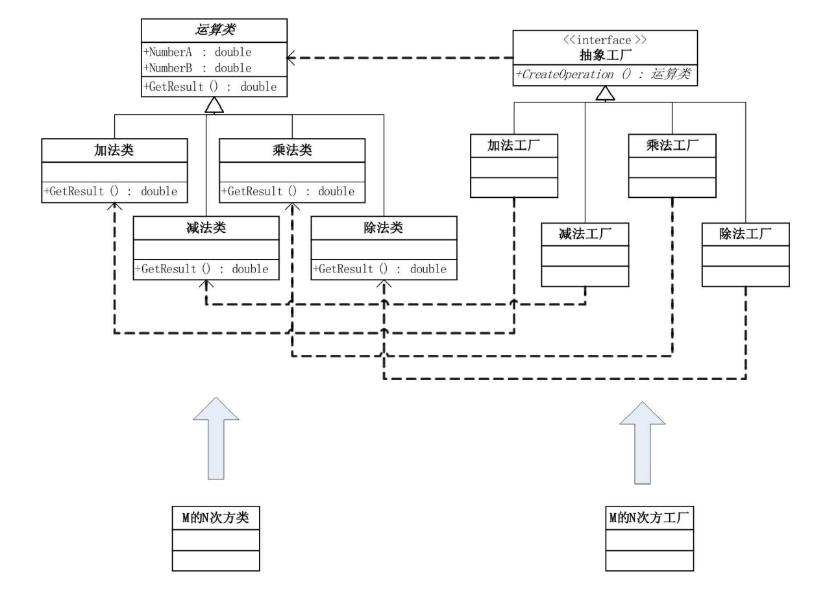

# 工厂方法模式

## 1 问题引入

### 1.1 问题描述

&emsp;&emsp;薛磊风等三名大学生以学习雷锋的名义去帮助老人做事（扫地、洗衣、买米等），他们毕业后依然以社区志愿者的身份帮助老人做事。

&emsp;&emsp;上述代理的故事可以用C++、Java、python、C#等任意一种编程语言实现。

### 1.2 问题分析

&emsp;&emsp;可以先用简单工厂模式实现，但由于学雷锋的学生毕业后，会转变身份成为社区志愿者，此时若使用简单工厂模式会涉及到工厂类的修改，违背开放封闭原则。可考虑将增加功能所导致的修改在客户端实现，即让客户端决定实例化哪一个工厂类。

### 1.3 解决方案

&emsp;&emsp;此时可以考虑使用`工厂方法模式`来解决问题。
1. 创建抽象类`LetFeng`，同时定义公共接口，即三种好事：      
    * 定义方法`Sweep()`，`Wash()`，`BuyRice()`。
2. 创建具体的做好事的类：学雷锋的大学生`Undergraduate`，及社区志愿者`Volunteer`，继承于抽象类`LetFeng`；
3. 创建雷锋工厂类`IFactory`，再定义学雷锋的大学生工厂`UndergraduateFactory`和社区志愿者工厂`VolunteerFactory`继承于雷锋工厂，用于创建具体的对象。

### 1.4 代码实现

* C++语言实现：[链接](https://github.com/datawhalechina/sweetalk-design-pattern/tree/main/src/design_patterns/cpp/factory_method/)
* Java语言实现：[链接](https://github.com/datawhalechina/sweetalk-design-pattern/tree/main/src/design_patterns/java/factory_method/)
* python语言实现：[链接](https://github.com/datawhalechina/sweetalk-design-pattern/tree/main/src/design_patterns/python/factory_method/LeiFengFactory.py)
* C#语言实现见原书第二版。

## 2 模式介绍

### 2.1 定义

&emsp;&emsp;`工厂方法模式（Factory Method Pattern）`是指定义一个用于创建对象的结构，让子类决定实例化哪个类。工厂方法使类的实例化过程延迟到其子类。

&emsp;&emsp;`工厂方法模式`实现时，客户端需要决定实例化哪一个工厂来实现功能类，即将简单工厂内部的逻辑判断已到了客户端进行。

### 2.2 结构

&emsp;&emsp;结构示意图如下

&emsp;&emsp;以简单工厂中的计算器实现为例，结构如下

## 3 适用场景

> 有明确的根据不同条件创造实例的计划时。将类类比为产品，产品具有系列/组合的形式，则使用者可以在不清楚类生产的具体过程及一个系列/组合的类包含的具体内容的情况下，使用一个系列的产品。    

> 有以下几类适合场景
> * 无法预知对象确切类别及其依赖关系时，工厂方法能将创建产品的代码与实际使用铲平的代码分离，从而能在不影响其他代码的情况下扩展产品创建的部分。
> * 希望用户能扩展软件库/框架的内部组件。

&emsp;&emsp;例如：

* 向一个已有多种运输方式（如卡车等）的物流应用新增一种运输方式：轮船。

## 4 评价

### 4.1 优点

* 可以避免创建者和具体产品之间的紧密耦合；
* 扩展性高，如果想增加一个新的产品，只需要扩展一个工厂类就可以；
* 符合“开放封闭原则”，无需更改现有工厂类代码，就可以引入新的功能；
* 符合“单一职责原则”，可以将产品创建代码放在程序的单一位置，从而使得代码更容易维护。

### 4.2 缺点

* 代码可能变得复杂，因为需要引入许多类。

## 参考资料
1. 《深入设计模式》

