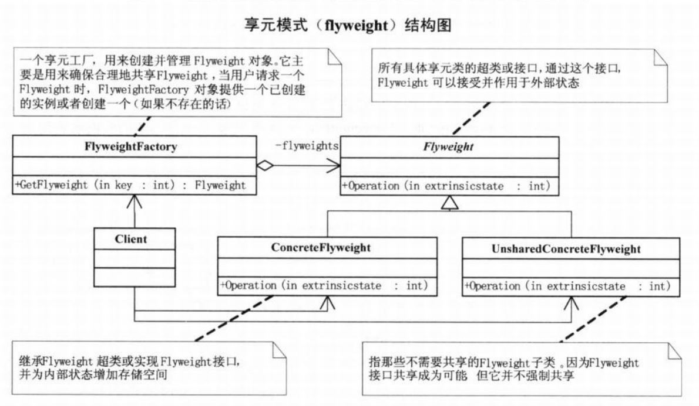

# 享元模式

## 问题引入

### 问题描述

实现数目较多的具有定制化要求的网站系统。

### 问题分析

网站系统的功能相似度很高，如果独立开发，对于出现bug或者新的需求变动会造成极高的维护量。

### 解决方案

享元模式可以避免大量非常相似类的开销，实现资源的共享。

## 模式介绍

### **定义**

享元模式，运用共享技术有效地支持大量细粒度的对象。

### **结构**

### 实现

**代码实现**

- C++ 实现：[链接](https://github.com/datawhalechina/sweetalk-design-pattern/src/design_patterns/cpp/flyweight)
- Java 实现：[链接](https://github.com/datawhalechina/sweetalk-design-pattern/src/design_patterns/java/flyweight)
- Python 实现：[链接](https://github.com/datawhalechina/sweetalk-design-pattern/src/design_patterns/python/flyweight)

## 使用场景

**适合场景**

一个是程序中大量的对象造成了较大的存储开销。另一个是对象的大多数状态可以外部状态，如果删除对象的外部状态，就可以用相对较少的共享对象取代很多组对象。

**实际应用**

1.jdk中基本类型的包装类的缓存机制。

2.数据库连接池等池化技术也运用了享元模式的思想。

## 模式评价

**模式优点**

实现代码和资源的共享，减少了维护成本

**不足之处**

提高了系统的复杂度