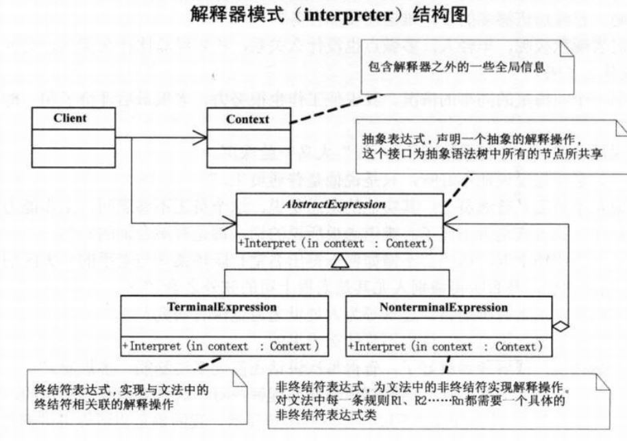

# 解释器模式

## 问题引入

### 问题描述

音乐解释器程序，根据自定义规则将音乐解释成简谱。

### **模式定义**

解释器模式，给定一个语言，定义它的文法的一种表示，并定义一个解释器，解释器使用该表示来解释语言中的句子。

### 问题分析

一种特定类型的问题发生的频率足够高，就值得将该问题的各个实例表述为一个简单语言中的句子。就可以考虑构建解释器解释这些句子。

## 模式介绍

### 解决方案

采用解释器模式，通过构建语法树，定义终结符与非终结符。

AbstractExpression(抽象表达式)：用于声明一个抽象的解释操作。

TerminalExpression(终结符表达式)：实现与文法的终结符相关联的解释操作。

NonterminalExpression(非终结符表达式)：为文法中的非终结符实现解释操作。

Context(上下文）：包含解释器之外的全局信息。

### 代码实现

```java
public abstract class Expression {
    public void interpret(PlayContext context) {
        if(context.getText().length() == 0) {
            return;
        }else {
            String playKey = context.getText().substring(0, 1);
            context.setText(context.getText().substring(2));
            double playValue = Double.parseDouble(context.getText().substring(0, context.getText().indexOf(" ")));
            context.setText(context.getText().substring(context.getText().indexOf(" ") + 1));

            excute(playKey,playValue);
        }
    }

    public abstract void excute(String key,double value);
}


public class Note extends Expression {
  @Override
    public void excute(String key, double value) {
      String note = "";
      switch (key){
          case "C":
              note = "1";
              break;
          case "D":
              note = "2";
              break;
          case "E":
              note = "3";
              break;
          case "F":
              note = "4";
              break;
          case "G":
              note = "5";
              break;
          case "A":
              note = "6";
              break;
          case "B":
              note = "7";
              break;
      }
      System.out.print(note + " ");
    }
}

public class Scale extends Expression {
    @Override
    public void excute(String key, double value) {
        String scale = "";
        switch ((int)value){
            case 1:
                scale = "低音";
                break;
            case 2:
                scale = "中音";
                break;
            case 3:
                scale = "高音";
                break;
        }
        System.out.print(scale + " ");
    }
}

public class Speed extends Expression {
    @Override
    public void excute(String key, double value) {
        String speed;
        if(value < 500) {
            speed = "快速";
        }else if (value >= 1000) {
            speed = "慢速";
        }else {
            speed = "中速";
        }
        System.out.print(speed + " ");
    }
}

public class PlayContext {
    private String text;

    public String getText() {
        return text;
    }
    public void setText(String text) {
        this.text = text;
    }
}

public class Main {
    public static void main(String[] args) {
        PlayContext context = new PlayContext();
        System.out.println("上海滩：");
        context.setText("O 2 E 0.5 G 0.5 A 3 E 0.5 G 0.5 D 3 E 0.5 G 0.5 A 0.5 O 3 C 1 O 2 A 0.5 G 1 C 0.5 E 0.5 D 3 ");

        Expression expression = null;
        try {
            while (context.getText().length() > 0) {
                String str = context.getText().substring(0, 1);
                switch (str){
                    case "O":
                        expression = new Scale();
                        break;
                    case "C":
                    case "D":
                    case "E":
                    case "F":
                    case "G":
                    case "A":
                    case "B":
                    case "P":
                        expression = new Note();
                        break;
                }
                expression.interpret(context);
            }
        } catch (Exception e) {
            e.printStackTrace();
        }

        System.out.println("\r\n上海滩：");
        context.setText("T 500 O 2 E 0.5 G 0.5 A 3 E 0.5 G 0.5 D 3 E 0.5 G 0.5 A 0.5 O 3 C 1 O 2 A 0.5 G 1 C 0.5 E 0.5 D 3 ");
        try {
            while (context.getText().length() > 0) {
                String str = context.getText().substring(0, 1);
                switch (str){
                    case "O":
                        expression = new Scale();
                        break;
                    case "T":
                        expression = new Speed();
                        break;
                    case "C":
                    case "D":
                    case "E":
                    case "F":
                    case "G":
                    case "A":
                    case "B":
                    case "P":
                        expression = new Note();
                        break;
                }
                expression.interpret(context);
            }
        } catch (Exception e) {
            e.printStackTrace();
        }
    }
}
```


### **结构**组成




## 模式评价

**适合场景**

重复出现的操作可以考虑使用简单的语言进行表达。

**实际应用**

Spring 框架中 SpelExpressionParser 就使用解释器模式

**模式优点**

解释器模式可以容易地改变和扩展文法。

**模式缺点**

解释器模式为文法中的每条规则至少定义了一个类，导致包含许多规则的文法可能难以管理和维护。