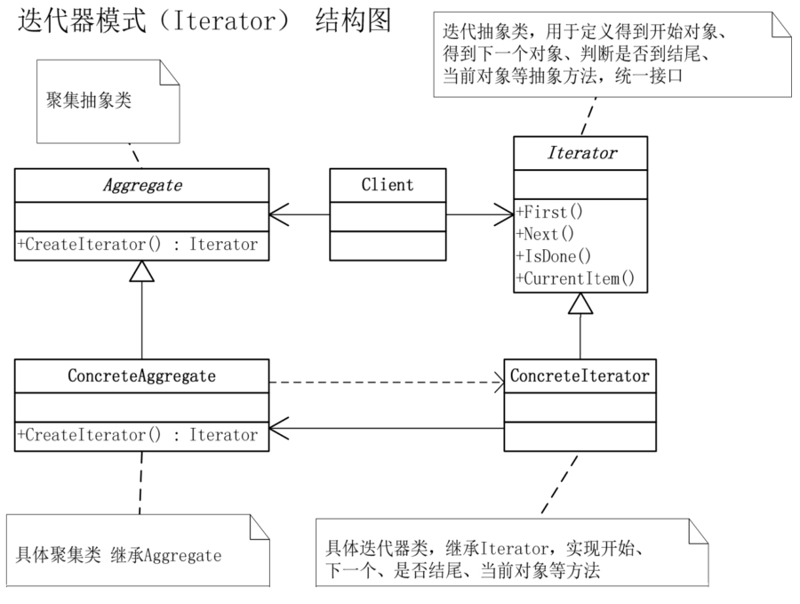

# 迭代器模式

## 模式引入

### 问题描述

实际生活中，我们经常遇到需要遍历一系列聚集对象的情况，比如排队买票，音乐播放列表等。当我们遍历这些对象时，由于它们本来是一个对象，导致我们不得不直接访问其内部列表。而且，如果我们要遍历另一个的对象时，同样的遍历方法又得重写一遍。

### 模式定义

像这种想要别人访问它的元素，但又不想暴露内部结构的情况，就可以使用迭代器模式。

迭代器模式（Iterator）是提供一种方法顺序访问一个聚集对象中各个元素，而又不暴露该对象的内部表示。

### 问题分析

将对列表的访问和遍历放到一个迭代器对象，迭代器定义访问元素的接口。此时，同样的遍历逻辑只需要实现一次。事实上，由于迭代器模式使用太普遍，大部分高级语言都已经对它进行了封装。

## 模式实现

### 解决方案

- 首先定义抽象聚集对象：`Aggregate` 类，定义 `createIterator` 方法，用于创建一个迭代器。
- 然后定义一个具体聚集对象：`ConcreteAggretate` 类，除了重写抽象方法外，还需定义简单的 `get`、`set`、`count` 等方法。
- 定义抽象迭代器对象：`Iterator` 类，一般包括：`first`、`next`、`isDone` 和 `currentItem` 几个抽象方法。
- 定义具体迭代器对象：`ConreteIterator` 类，重写抽象方法，实现对对象的迭代。

### 代码实现

`Aggregate` 类：

```java
public abstract class Aggregate {
    public abstract Iterator createIterator();
}
```

`ConcreteAggregate` 类：

```java
public class ConcreteAggregate extends Aggregate {
    private List<Object> items = new ArrayList<>();

    @Override
    public Iterator createIterator() {
        return new ConcreteIterator(this);
    }

    public int Count() {
        return items.size();
    }

    public Object get(int index) {
        return items.get(index);
    }

    public void set(int index, String value) {
        items.add(index, value);
    }
}
```

`Iterator` 类：

```java
public abstract class Iterator {
    public abstract Object first();
    public abstract Object next();
    public abstract boolean isDone();
    public abstract Object currentItem();
}
```

`ConcreteIterator` 类：

```java
public class ConcreteIterator extends Iterator {
    private ConcreteAggregate aggregate;
    private int current = 0;

    public ConcreteIterator(ConcreteAggregate aggregate) {
        this.aggregate = aggregate;
    }

    @Override
    public Object first() {
        return aggregate.get(0);
    }

    @Override
    public Object next() {
        Object ret = null;
        current++;
        if(current < aggregate.Count()) {
            ret = aggregate.get(current);
        }
        return ret;
    }

    @Override
    public boolean isDone() {
        return current >= aggregate.Count();
    }

    @Override
    public Object currentItem() {
        return aggregate.get(current);
    }
}
```

`Main` 方法：

```java
public class Main {
    public static void main(String[] args) {
        ConcreteAggregate a = new ConcreteAggregate();
        a.set(0, "大鸟");
        a.set(1,"小菜");
        a.set(2,"行李");
        a.set(3,"老外");
        a.set(4,"公交内部员工");
        a.set(5,"小偷");

        Iterator i = new ConcreteIterator(a);

        while (!i.isDone()){
            System.out.println(i.currentItem() + " 请买车票");
            i.next();
        }
    }
}
```

执行结果：

```bash
大鸟 请买车票
小菜 请买车票
行李 请买车票
老外 请买车票
公交内部员工 请买车票
小偷 请买车票
```

### 结构组成



- 聚集抽象类（Aggregate）。
- 具体聚集类（ConcreteAggregate）。
- 迭代抽象类（Iterator）：用于定义各种行为的抽象方法，统一接口。
- 具体迭代器类（ConcreteIterator）：继承 Iterator，实现具体行为的方法。

## 模式评价

### 适用场景

- 当需要遍历访问一个聚集对象，而且不管这些对象是什么。
- 内部结构复杂，只提供精简的访问方式。
- 对聚集对象支持多种方式遍历。

### 实际应用

- 列表、队列等容器。
- 字符串序列。

### 优点缺点

迭代器模式优点包括：

- 减少重复遍历代码。
- 存储与遍历分离。
- 简化数据访问方式。

迭代器模式缺点包括：

- 过于简单的集合会增加复杂性。
- 增加新的聚集类时可能需要新的迭代器。