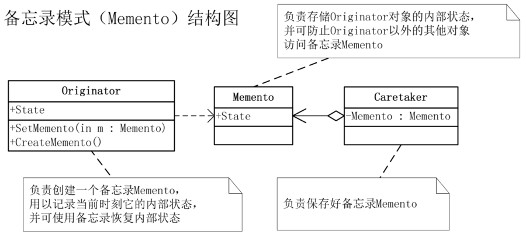

# 备忘录模式

## 模式引入

### 问题描述

如果我们玩过 RPG 游戏，就知道在关键时点需要进行存档，否则一不小心就可能给出「大侠，请重新来过」的提示，这就需要有一个存档功能。考虑最简单的实现，直接用一个队列或字典将对应时点的状态存起来就行了，当需要恢复某个历史状态时，将对应的状态取出，更新到当前状态。但是这个「保存」和「恢复」在写程序时会有一些问题，大部分的面向对象语言都不允许对私有成员进行外部访问，这有益于程序的健壮。

### 模式定义

像刚刚这种情况，当公共接口无法从外部获取一个对象的内部状态，但我们又需要访问和处理它的内部状态，此时可以使用备忘录模式。

备忘录模式（Memento）是在不破坏封装性的前提下，捕获一个对象的内部状态，并在该对象之外保存这个状态，这样以后就可以将该对象恢复到原先保存的状态。

### 问题分析

让我们用备忘录模式实现问题中的存档，备忘录（存档）用来存储游戏进行到某个时间点的角色状态。当保存状态时，玩家发起一个备忘角色当前时间点的状态到备忘录（存档）；恢复状态时，将该时间点的备忘录（存档）恢复到游戏。

## 模式实现

### 解决方案

- 首先需要定义一个游戏角色 `GameRole`，并定义角色方法。当然，最主要要的是保存状态 `saveState` 和恢复状态 `recoveryState` 方法。
- 然后是游戏角色存档 `RoleStateMemento`，里面存有角色在存档时间点的所有状态。
- 最后是角色状态管理者 `RoleStateCaretaker`，用来设置或获取对应的存档。

### 代码实现

`Originator` 类：

```java
public class GameRole {
    // 生命力
    private int vit;
    // 攻击力
    private int atk;
    // 防御力
    private int def;

    public int getVit() {
        return vit;
    }
    public void setVit(int vit) {
        this.vit = vit;
    }

    public int getAtk() {
        return atk;
    }

    public void setAtk(int atk) {
        this.atk = atk;
    }

    public int getDef() {
        return def;
    }

    public void setDef(int def) {
        this.def = def;
    }

    // 状态显示
    public void stateDisplay() {
        System.out.println("当前角色状态：");
        System.out.println("体力：" + this.vit);
        System.out.println("攻击力：" + this.atk);
        System.out.println("防御力：" + this.def);
        System.out.println();
    }

    // 获得初始状态
    public void getInitState() {
        this.vit = 100;
        this.atk = 100;
        this.def = 100;
    }

    // 战斗
    public void fight() {
        this.vit = 0;
        this.atk = 0;
        this.def = 0;
    }

    // 保存游戏状态
    public RoleStateMemento saveState() {
        return new RoleStateMemento(vit, atk, def);
    }

    // 恢复角色状态
    public void recoveryState(RoleStateMemento memento) {
        this.vit = memento.getVit();
        this.atk = memento.getAtk();
        this.def = memento.getDef();
    }
}
```

`Memento` 类：

```java
public class RoleStateMemento {
    private int vit;
    private int atk;
    private int def;

    public int getVit() {
        return vit;
    }

    public void setVit(int vit) {
        this.vit = vit;
    }

    public int getAtk() {
        return atk;
    }

    public void setAtk(int atk) {
        this.atk = atk;
    }

    public int getDef() {
        return def;
    }

    public void setDef(int def) {
        this.def = def;
    }

    public RoleStateMemento(int vit, int atk, int def) {
        this.vit = vit;
        this.atk = atk;
        this.def = def;
    }

    public RoleStateMemento() {}
}
```

`Careataker` 类：

```java
public class RoleStateCaretaker {
    private RoleStateMemento memento;

    public RoleStateMemento getMemento() {
        return memento;
    }

    public void setMemento(RoleStateMemento memento) {
        this.memento = memento;
    }
}
```

`Main` 方法：

```java
public class Main {
    public static void main(String[] args) {
        // 大战Boss前
        GameRole lixiaoyao = new GameRole();
        lixiaoyao.getInitState();
        lixiaoyao.stateDisplay();

        // 保存进度
        RoleStateCaretaker stateAdmin = new RoleStateCaretaker();
        stateAdmin.setMemento(lixiaoyao.saveState());

        // 大战Boss时，损耗严重
        lixiaoyao.fight();
        lixiaoyao.stateDisplay();

        // 恢复之前状态
        lixiaoyao.recoveryState(stateAdmin.getMemento());
        lixiaoyao.stateDisplay();
    }
}
```

执行结果：

```bash
当前角色状态：
体力：100
攻击力：100
防御力：100

当前角色状态：
体力：0
攻击力：0
防御力：0

当前角色状态：
体力：100
攻击力：100
防御力：100
```

### 结构组成



- Originator（发起人）：负责创建一个备忘录 Memento，用以记录当前时刻它的内部状态，并可使用备忘录恢复内部状态。Originator 可根据需要决定 Memento 存储 Originator 的哪些内部状态。
- Memento（备忘录）：负责存储 Originator 对象的内部状态，并可防止 Originator 以外的其他对象访问备忘录 Memento。备忘录有两个接口，Caretaker 只能看到备忘录的窄接口，它只能将备忘录传递给其他对象。Originator 能够看到一个宽接口，允许它访问返回到先前状态所需的所有数据。
- Caretaker（管理者）：负责保存好备忘录 Memento，不能对备忘录的内容进行操作或检查。

## 模式评价

### 适用场景

- 必须保存某一时刻的状态以便需要时恢复时。
- 需要回滚、撤销等功能时。

### 实际应用

- 游戏副本存储。
- 编辑器的撤销操作。
- 数据库回滚、操作系统恢复等。

### 优点缺点

备忘录模式优点包括：

- 可以恢复到任意历史状态。
- 保持封装边界。

备忘录模式缺点包括：

- 状态数据很大时可能非常消耗资源。尤其是编辑器，如果一直不间断保存所有编辑记录，最终一篇稿子形成时将会消耗非常庞大的资源。