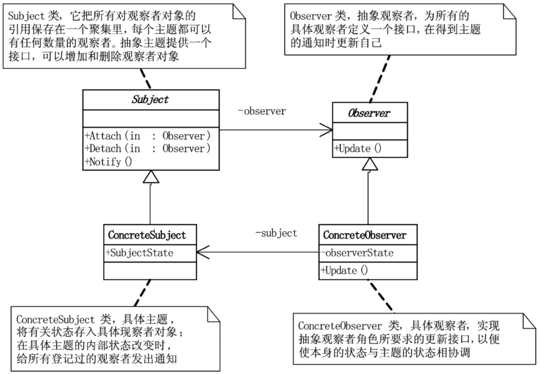

# 观察者模式

## 模式引入

### 问题描述

我们设想一个场景，假设公司几个同事日常喜欢工作摸鱼，有看 NBA 的，有炒股的，还有玩儿游戏的。但摸鱼肯定怕被自己领导或老板发现，怎么办呢？他们只好每隔几分钟就起来看看老板或者自己的领导有没有回来。这很不方便，想象一下，如果有几十个同事在摸鱼（这公司怕是要倒闭了），大家总不能跟赶集一样，隔几分钟就起来走几步吧。

此时，有人突拍大腿：为啥不整个吹哨人呢，比如前台小妹子？如果老板来了，她只需给我们发个微信消息通知一下就行了呀——有道理！先建个群把大家都拉进去，有领导来了就让前台小妹发消息。这下方便了，只要消息来了就知道是领导来了，赶紧采取行动。而且，如果这会儿突然不想摸鱼了，那把消息屏蔽了就行，明天又想摸鱼，把消息屏蔽取消就可以了。皆大欢喜。

### 模式定义

一般来说，将系统分割成一系列相互协作的类有个很不好的副作用，就是需要维护相关对象间的一致性。为了维护所需的一致性又不至于使各类紧密耦合，导致维护和扩展的不便，引入观察者模式。

观察者模式又叫发布-订阅（Publish/Subscribe）模式。它定义了一种**一对多**的依赖关系，多个观察者对象同时监听一个主题对象。当该主题对象的**状态发生变化**时，所有的观察者都会得到**通知并自动更新**。它描述了单个对象和一个或多个对象之间的发布-订阅关系。

### 问题分析

我们用观察者模式重新分析开始的问题，针对领导的群就是 Subject，员工则是 Observer，一个 Subject 可以有多个 Observer，它不需要关心到底有哪些 Observer，Observer 之间也不需要知道彼此存在。当 Subject 的状态发生变化（即领导回来）时，所有的 Observer 都会得到通知，并更新自己的行为（努力工作）。

当然，反过来一个 Observer 可以订阅多个 Subject，任意一个 Subject 的状态发生变化，该 Observer 都会得到通知。这样就既解决了一致性问题，又不会过紧耦合。

## 模式实现

### 解决方案

共需要实现两个抽象类，以及它们对应的具体类。

- 主题抽象类 `Subject`，定义 `attach`、`detach` 和 `inform` 方法。
- 观察者抽象类 `Observer`，定义 `update` 方法。
- 具体主题类 `Boss`。
- 具体观察者类 `NBAObserver`，`StockObserver` 等，每个类重写自己的 `update` 方法。

另外需要注意，有两种方式可以实现通知：

- 推模型：Subject 起主导作用，向 Observer 推送。
- 拉模型：Subject 对变化进行广播，由 Observer 负责拉取更新。

我们下面用第一种方式实现。

### 代码实现


`Subject` 类：

```java
public interface Subject {
    void attach(Observer observer);
    void detach(Observer observer);
    void inform();

    String getSubjectState();
    void setSubjectState(String action);
}
```

`Observer` 类：

```java
public abstract class Observer {
    protected String name;
    protected Subject sub;

    public Observer(String name, Subject sub) {
        this.name = name;
        this.sub = sub;
    }

    public abstract void update();
}
```

`ConcreteSubject` 类：

```java
public class Boss implements Subject {
    private List<Observer> observers = new ArrayList<>();
    private String action;

    @Override
    public void attach(Observer observer) {
        observers.add(observer);
    }

    @Override
    public void detach(Observer observer) {
        observers.remove(observer);
    }

    @Override
    public void inform() {
        for(Observer o : observers){
            o.update();
        }
    }

    @Override
    public String getSubjectState() {
        return action;
    }

    @Override
    public void setSubjectState(String action) {
        this.action = action;
    }
}
```

`ConcreteObserver` 类：

```java
public class NBAObserver extends Observer {
    public NBAObserver(String name, Subject sub) {
        super(name, sub);
    }

    @Override
    public void update() {
        System.out.println(sub.getSubjectState() + " " + name + " 关闭NBA直播，继续工作！");
    }
}

public class StockObserver extends Observer {
    public StockObserver(String name, Subject sub) {
        super(name, sub);
    }

    @Override
    public void update() {
        System.out.println(sub.getSubjectState() + " " + name + " 关闭股票行情，继续工作！");
    }
}
```


`Main` 方法：

```java
public class Main {
    public static void main(String[] args) {
        Boss huhansan = new Boss();

        Observer tongshi1 = new StockObserver("魏关姹", huhansan);
        Observer tongshi2 = new NBAObserver("易管查", huhansan);

        huhansan.attach(tongshi1);
        huhansan.attach(tongshi2);

        huhansan.detach(tongshi1);
        huhansan.setSubjectState("我胡汉三回来了！");
        huhansan.inform();
    }
}
```

执行结果：

```bash
我胡汉三回来了！ 易管查 关闭NBA直播，继续工作！
```

### 结构组成



- Subject 类：主题或抽象通知者，一般用一个抽象类或接口实现。它把所有观察者对象的引用保存在一个聚集里，可以有任意数量的观察者。抽象主题提供可以增加或删除观察者的接口。
- Observer 类：抽象观察者，为具体观察者定义一个抽象类或接口，得到主题的通知时更新自己。通常含有一个更新方法。
- ConcreteSubject 类：具体主题或通知者，将有关状态存入具体观察者对象。在具体主题内部状态改变时，给所有登记过的观察者发送通知。
- ConcreteObserver 类：具体观察者，实现抽象观察者要求的更新接口。可以保存一个指向具体主题的引用。

## 模式评价

### 适用场景

- 当一个对象的改变需要同时改变多个（不知道具体数目）对象时。就比如例子中的员工数，多少个都可以。
- 当一个抽象模型的两个方面一方依赖于另一方时，将两者封装在独立的对象中。

### 实际应用

实际中的例子：批量自动更新。

- RSS 之类的订阅应用。比如订阅了大牛的博客，大牛更新博客后会自动将其同步到阅读器。
- 消息、通知类应用。比如微信公众号，关注后有新消息发布就推送到我们的手机上。
- 竞拍、股票类应用。比如炒股工具，当一支股票价格发生变化时，我们手里的软件会自动更新波动。

### 优点缺点

观察者模式优点包括：

- Subject 和 Observer 之间松耦合，可以轻松扩展。而且两者都可以扩展，不会对系统造成影响。
- 支持广播通信，不需要指定接收者，而且可以随时增删 Observer。

观察者模式缺点包括：

- 不同的订阅者可能需要不同的更新（功能），而不是所有的都一样。比如炒股的可能要切换桌面，而看 NBA 的既要切换桌面还得关掉声音。
- Subject 依赖于 Observer 对抽象接口的实现，没有实现就无法更新。比如炒股的没有实现更新方法，那他的摸鱼行为自然就要暴露了。


