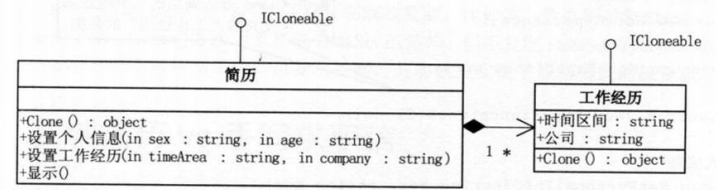

# 原型模式

## 1 问题引入

### 1.1 问题描述

&emsp;&emsp;小菜求职篇，小菜需要写三份简历：有一个简历类，必须有姓名，可以设置性别、年龄和工作经历（工作经历包含时间区间和公司名称的属性）。

### 1.2 问题分析
1. 客户端代码，在生成三份简历时，应当避免多次执行初始化操作。
    > 一般在初始化信息不发生变化的情况下，克隆是较好的方法。它既隐藏了对象创建的细节，又提升了性能。

2. 浅复制和深复制：

    (1) 浅复制：可以复制值类型；但对于引用类型，只复制引用，不复制引用的对象。
    > 例如：简历类中有"设置工作经历"的方法，通常"工作经历"类有"时间区间"和"公司名称"等属性。如果简单Clone简历类，那么"工作经历"中的属性不会被复制。

    (2) 深复制：对于引用类型，也会复制一份新对象，而不是只复制引用。
    > 例如："工作经历"类的"时间区间"和"公司名称等属性"，也可以被复制。

### 1.3 解决方案

&emsp;&emsp;可以考虑使用`原型模式`来解决问题：
1. 客户端只需调用Clone方法，就可以实现新简历的生成，并且可以再修改简历的细节；
2. 工作经历类实现Clone方法；
3. 简历类引用"工作经历"对象：
    - 在简历类实例化时，同时实例化"工作经历"；
    - 提供私有构造方法，Clone"工作经历"的数据。

### 1.4 代码实现

* C++语言实现：[链接]("https://github.com/datawhalechina/sweetalk-design-pattern/src/design_patterns/cpp/prototype/")
* Java语言实现：[链接]("https://github.com/datawhalechina/sweetalk-design-pattern/src/design_patterns/java/prototype/")
* python语言实现：[链接]("https://github.com/datawhalechina/sweetalk-design-pattern/src/design_patterns/python/prototype/Prototype.py")
* C#语言实现见原书第二版。

## 2 模式介绍

### 2.1 定义

&emsp;&emsp;`原型模式（Prototype）`是创建型模式的一种。它用原型实例指定创建对象的种类，并通过拷贝这些原型创建新的对象。
- 通过**复制**一个已存在的实例，返回新的实例（没有新建实例），**原型**指被复制的实例。
- 实现克隆操作，必须实现 Cloneable接口

### 2.2 结构

&emsp;&emsp;原型模式其实就是从一个对象再创建另一个可定制的对象，并且不需知道任何创建细节。

以上述问题为例，结构如下

## 3 适用场景

> 实际项目中，原型模式很少单独出现。一般和工厂方法模式一起出现，通过Clone创建对象，然后由工厂方法提供给调用者。

- 直接创建对象的代价较大时，常采用原型模式，可提升性能；
- new一个对象需要非常繁琐的数据准备或访问权限；
- 一个对象多个修改者的场景。

## 4 评价
### 4.1 优点
- 提高性能；
- 逃避构造函数的约束。

### 4.2 缺点
- 需要对类的功能进行通盘考虑，对于已有的类不一定很容易，特别当一个类引用不支持串行化的间接对象，或者引用含有循环结构的时候；
- 必须实现Cloneable接口。

## 5 参考资料
&emsp;&emsp;[原型模式 - 菜鸟教程](https://www.runoob.com/design-pattern/prototype-pattern.html)