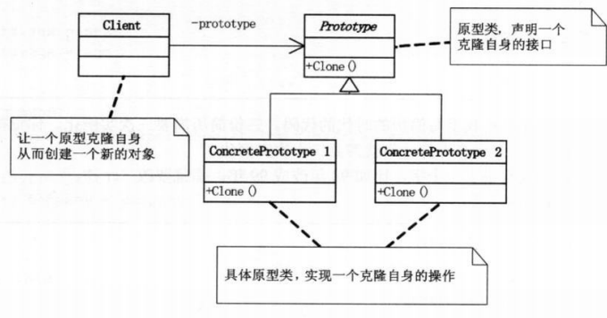

# 原型模式

## 模式引入

### 问题描述

设想我们需要给不同时间点的自己写三份简历，此时姓名和性别等信息是不变的，只有年龄和工作经历（工作经历包含时间区间和公司名称的属性）有稍许变化。

进行多次实例化，会降低性能。如果能在克隆基础上，做少许更改就好了！

### 模式定义

`原型模式（Prototype）`是创建型模式的一种。它用原型实例指定创建对象的种类，并通过拷贝这些原型创建新的对象。
- 通过**复制**一个已存在的实例，返回新的实例（没有新建实例），**原型**指被复制的实例；
- 实现克隆操作，必须实现 Cloneable接口。

### 问题分析

- 客户端代码，在生成三份简历时，应当避免多次执行初始化操作。
    > 一般在初始化信息不发生变化的情况下，克隆是较好的方法。它既隐藏了对象创建的细节，又提升了性能。

- 浅复制和深复制：

    (1) 浅复制：可以复制值类型；但对于引用类型，只复制引用，不复制引用的对象。
    > 例如：简历类中有"设置工作经历"的方法，通常"工作经历"类有"时间区间"和"公司名称"等属性。如果简单Clone简历类，那么"工作经历"中的属性不会被复制。

    (2) 深复制：对于引用类型，也会复制一份新对象，而不是只复制引用。
    > 例如："工作经历"类的"时间区间"和"公司名称等属性"，也可以被复制。

## 模式介绍

### 解决方案
- 客户端只需调用Clone方法，就可以实现新简历的生成，并且可以再修改简历的细节；
- 工作经历类实现Clone方法；
- 在简历类中，引用"工作经历"对象：
    - 在实例化简历类时，同时实例化"工作经历"；
    - 在简历类中提供私有构造方法，Clone"工作经历"的数据。

### 代码实现
工作经验类：
```java
public class WorkExperience implements Cloneable {
    private String workDate;
    private String workCompany;

    public String getWorkDate() {
        return workDate;
    }

    public void setWorkDate(String workDate) {
        this.workDate = workDate;
    }

    public String getWorkCompany() {
        return workCompany;
    }

    public void setWorkCompany(String workCompany) {
        this.workCompany = workCompany;
    }

    public Object Clone() {
        try{
            return (Object)clone();
        }catch (CloneNotSupportedException ex) {
            ex.printStackTrace();
        }
        return null;
    }
}
```

简历类
```java
public class Resume implements Cloneable {
    private String name;
    private String sex;
    private String age;
    private WorkExperience work;

    public Resume(String name) {
        this.name = name;
        this.work = new WorkExperience();
    }

    private Resume(WorkExperience work) {
        this.work = (WorkExperience)work.Clone();
    }

    public void setPersonalInfo(String sex, String age) {
        this.sex = sex;
        this.age = age;
    }

    public void SetWorkExperience(String workDate, String company) {
        work.setWorkDate(workDate);
        work.setWorkCompany(company);
    }

    public void display() {
        System.out.println(this.getName() + " " + this.getSex() + " " + this.getAge());
        System.out.println("Work experience: " + work.getWorkDate() + " " + work.getWorkCompany());
    }

    public Object Clone() {
        Resume obj = new Resume(this.work);
        obj.name = this.name;
        obj.sex = this.sex;
        obj.age = this.age;
        return obj;
    }

    public String getName() {
        return this.name;
    }
    public String getSex() {
        return this.sex;
    }
    public String getAge() {
        return this.age;
    }
}
```

客户端调用的代码：
```java
public class ResumeClient {
    public static void main(String[] args) {
        Resume a = new Resume("Big bird");
        a.setPersonalInfo("Female", "29");
        a.SetWorkExperience("1998-2000", "Datawhale");
        a.display();
    } 
}
```

执行结果：

```bash
Big bird Female 29
Work experience: 1998-2000 Datawhale
```

### 结构组成

原型模式其实就是从一个对象再创建另一个可定制的对象，并且不需知道任何创建细节。



- Prototype：原型类，是一个抽象类，有Clone方法；
- ConcretePrototype：具体原型类，创建当前对象的浅表副本；
- Client：克隆ConcretePrototype的对象，就能得到新的实例。


## 模式评价

### 适用场景

> 实际项目中，原型模式很少单独出现。一般和工厂方法模式一起出现，通过Clone创建对象，然后由工厂方法提供给调用者。

- 直接创建对象的代价较大时，常采用原型模式，可提升性能；
- new一个对象需要非常繁琐的数据准备或访问权限；
- 一个对象多个修改者的场景。

### 优点缺点

优点：
- 提高性能；
- 逃避构造函数的约束。

缺点：
- 需要对类的功能进行通盘考虑，对于已有的类不一定很容易。特别当一个类引用不支持串行化的间接对象，或者引用含有循环结构的时候；
- 必须实现Cloneable接口。