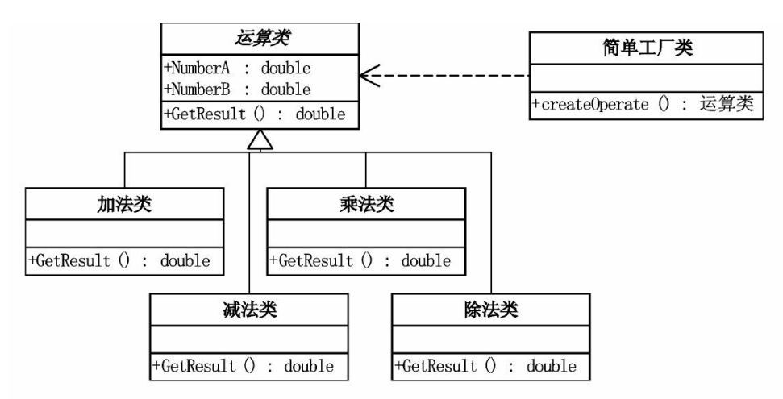

# 简单工厂模式

## 模式引入

### 问题描述

小菜参加面试，面试要求用面向对象语言实现一个计算器控制台程序，要求输入两个数和运算符号，得到结果。要实现这一程序并不困难，但若未来该程序要增添新的运算符号，而仍想使用这个程序的话，程序应当要设计得耦合性低些，尽量减少增加功能时需要的改动。同时，应该考虑把计算部分独立出来，这样如果未来该windows程序迁移到web版，计算部分也不需要修改。

### 模式定义

`简单工厂模式（Simple Factory Pattern）`是用一个单独的类来实现具体的实例化过程，避免客户端对具体实例化过程的显式指定。

### 问题分析

`简单工厂模式`可以用于这个问题。将加减乘除等运算类独立实现，并创建工厂类维护对运算类的使用。之后若需要增加新的运算符号，则只需增加运算类，修改工厂类即可，这也同时降低修改后的重复编译量（松耦合）。此外，简单工厂模式降了低业务逻辑和界面逻辑的耦合，易于复用（不是复制），若未来该windows程序迁移到web版，业务部分（计算部分）不需要修改。

## 模式实现

### 解决方案

使用`简单工厂模式`来解决问题。
1. 首先定义一个抽象的运算类`Operation`，定义抽象类的同时定义其所有子类的公共接口，并定义一个方法`getResult(numberA,numberB)`用于得到结果；
2. 分别创造具体的加减乘除运算类，都为抽象运算类的子类，则具体运算类之中若有一者需要修改，不会影响其它的运算类。覆写具体运算类中`getResult(numberA,numberB)`方法实现运算操作；
3. 创建简单工厂类`OperationFactory`，根据输入参数，使用条件判断调用具体的运算类，实现业务逻辑和界面逻辑的分离。

### 代码实现

*此处我们使用Java语言来实现这一方案，C#语言实现可见原书原版，本项目的所有语言实现可见本项目Github仓库，其中包括：[C++](https://github.com/datawhalechina/sweetalk-design-pattern/tree/main/src/design_patterns/cpp/simple_factory/)，[Java](https://github.com/datawhalechina/sweetalk-design-pattern/tree/main/src/design_patterns/java/simple_factory//)，[python](https://github.com/datawhalechina/sweetalk-design-pattern/tree/main/src/design_patterns/python/simple_factory/SimpleFactory.py)，读者可按需参阅。*

首先定义一个抽象运算类。

```Java
public abstract class Operation {
    public double numberA;
    public double numberB;

    public abstract double getResult();
}
```

定义加减乘除等运算类。

```Java
public class OperationAdd extends Operation {
    @Override
    public double getResult() {
        return numberA + numberB;
    }
}

public class OperationSub extends Operation {
    @Override
    public double getResult() {
        return numberA - numberB;
    }
}

public class OperationMul extends Operation {
    @Override
    public double getResult() {
        return numberA * numberB;
    }
}

public class OperationDiv extends Operation {
    @Override
    public double getResult() {
        if(numberB == 0){
            throw new RuntimeException("除数不能为0。");
        }
        return numberA / numberB;
    }
}
```

简单运算工厂类维护创造运算实例的过程。

```Java
public class OperationFactory {
    public static Operation createOperation(char operator) {
        Operation operation = null;

        switch (operator) {
            case '+':
                operation = new OperationAdd();
                break;
            case '-':
                operation = new OperationSub();
                break;
            case '*':
                operation = new OperationMul();
                break;
            case '/':
                operation = new OperationDiv();
                break;
        }
        return operation;
    }  
}
```

客户端如下。

```Java
public class Calculator {
    public static void main(String[] args) {
        Operation operation;
        char operator;
    
        operator = '+';
        operation = OperationFactory.createOperation(operator);
        operation.numberA = 1;
        operation.numberB = 2;
    
        System.out.println(operation.getResult());
    }
}
```

运行结果如下。
```
3
```

### 结构组成

简单工厂模式由三类主要角色组成：
 1. 抽象类：定义所有支持算法的公共接口，在这个例子中具体运算抽象类；
 2. 具体算法类：具体的算法，在这个例子中具体为加减乘除运算类；
 3. 简单工厂类：维护对运算类的应用。

以上述问题为例，结构如下



## 模式评价

### 适用场景

将类类比为产品，则使用者可以在不清楚类生产的具体过程的情况下，使用不同的产品。
