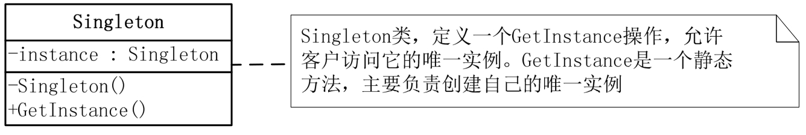

# 单例模式

## 模式引入

### 问题描述

一个类只能有一个实例在生活中是很常见的，比如打印机程序，政府部门。当我们创建这些类的实例时，我们希望每次创建后得到的都是同一个实例。很直观地，我们知道需要在构造函数上下功夫，当我们需要创建一个新的实例时，如果已经有了该类的实例，就直接返回，而不是新建一个。

### 模式定义

此时，我们可以使用单例模式，它可以保证客户只能访问一个唯一的实例，而且还能保证没有其他实例可以被创建。

单例模式（Singleton）是保证一个类仅有一个实例，并提供一个访问它的全局访问点。通常我们可以让一个全局变量使得一个对象被访问，但它不能防止你实例化多个对象。一个最好的办法就是，让类自身负责保存它的唯一实例。这个类可以保证没有其他实例可以被创建，并且它可以提供一个访问该实例的方法。

### 问题分析

对一些只需要一个全局实例的情况，推荐使用单例模式。

## 模式实现

### 解决方案

**多线程时的单例模式**

- 使用锁控制线程的访问：`lock` 确保当一个线程位于代码的临界区时，另一个线程不进入临界区。如果其他线程试图进入锁定的代码，则它将一直等待（即被阻止），直到该对象被释放。

**改善性能的双重锁定**

- 先判断实例是否存在，不存在再加锁处理，避免线程每次都加锁，也能保证多线程的安全，该做法被称为 `Double-Check Locking`。

**简单的静态初始化**

- 使用静态初始化方法，不需要开发人员显式地编写线程安全代码，即可解决多线程环境下不安全的问题（书中介绍的是 C# 与公共语言运行库的做法，其他语言也有相同的方法）。

两种方式对比：

- 饿汉式单例类：静态初始化方法在自己被加载时，将自己实例化。
- 懒汉式单例类：在第一次被引用时，才会将自己实例化。

### 代码实现

双重锁定：

```java
public class Singleton {
    private volatile static Singleton instance;

    private Singleton() {}

    public static Singleton getInstance() {
        if(instance == null){
            synchronized (Singleton.class) {
                if(instance == null){
                    instance = new Singleton();
                }
            }
        }
        return instance;
    }
}
```

静态初始化：

```java
public class StaticSingleton {
    private static StaticSingleton instance = new StaticSingleton();
    private StaticSingleton() {
    }
    public static StaticSingleton getInstance() {
        return instance;
    }
}
```

`Main` 方法：

```java
public class Main {
    public static void main(String[] args) {
        Singleton s1 = Singleton.getInstance();
        Singleton s2 = Singleton.getInstance();

        if(s1 == s2) {
            System.out.println("两个对象是相同的实例。");
        }

        // 多线程
        Set<String> instanceSet = Collections.synchronizedSet(new HashSet<>());
        for (int i = 0; i < 100; i++) {
            new Thread(() -> {
                instanceSet.add(Singleton.getInstance().toString());
            }).start();
        }
        for (String instance : instanceSet) {
            System.out.println(instance);
        }
    }
}
```

执行结果：

```bash
两个对象是相同的实例。
```

### 结构组成



- 单例模式包括一个 Singleton 类，主要是定义创建实例的方法，允许访问它的唯一实例，该方法是一个静态方法，主要负责创建自己的唯一实例。
- 单例模式因为 Singleton 类封装它的唯一实例，可以严格控制客户怎样访问它以及何时访问它。简单地说，就是对唯一实例的受控访问。

## 模式评价

### 适用场景

- 当希望类只能有一个实例时。
- 需要维护某种全局状态时。
- 控制对共享资源的并发访问。

### 实际应用

- 数据库连接。
- 日志系统。
- 打印机后台程序。

### 优点缺点

单例模式优点包括：

- 保证一个类只有一个实例。
- 对唯一实例的受控访问。

单例模式缺点包括：

- 全局变量可能已经被修改，但其他位置并不知道。
- 可能会对同一个对象创建多个引用。
- 与所有依赖该类的类耦合比较紧密。
