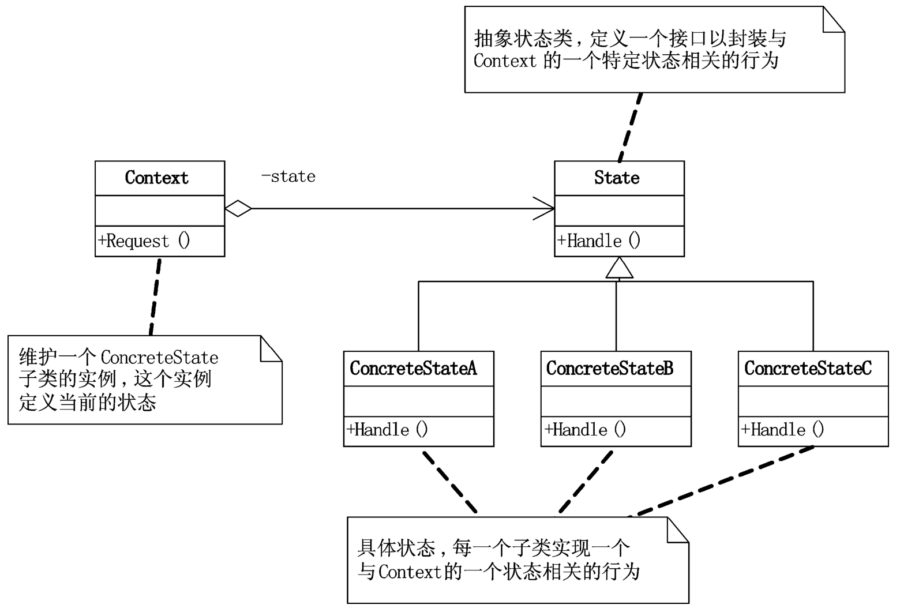

# 状态模式

## 模式引入

### 问题描述

假设我们要描述一名员工一天不同时间的工作状态，正常来看是比较简单的，直接从早上上班开始，根据一些时间变化切换到其他状态。但假设我们切换到一个状态后又可能需要根据另外的条件再次切换，比如本来在写代码，到晚上了还没写完，继续写。好不容易写完了，需要切换到下班状态；或者没写完，直到睡着还没写完。这需要各种条件判断（每个状态都要判断是否满足跳到其他状态），不光是写起来复杂，新增状态和更新状态更是会变得异常麻烦。

此时，很自然我们就会想要将一个个状态独立出来，为每个状态设置所有需要的切换条件，在状态发生变化时改变对应的行为。这样我们只需要关心状态从 A 转换到 B，而不用管各种判断逻辑。

### 模式定义

当控制一个对象状态转换的条件表达式过于复杂时，把状态的判断逻辑转移到表示不同状态的一系列类中，可以简化复杂的判断逻辑。

状态模式允许一个对象在内部状态改变时改变它的行为，这个对象看起来好像改变了类。

状态模式将不同状态的行为分割开，将与特定状态相关的行为局部化（放入一个对象），通过新的类很容易新增状态。状态模式通过把各种状态的转移逻辑分布到 State 的子类之间，减少相互依赖，消除庞大的条件分支判断。

### 问题分析

考虑用状态模式来实现上面的问题，具体来说，我们可以将不同时间段、休息、睡觉等都设置为一个个状态，每个状态内部有自己的转换判断，比如上午可以切换到下午，但不能直接切换到下班。这样每种状态有自己的判断逻辑，行为和状态绑定，外部只需直接切换到想要的状态即可。

## 模式实现

### 解决方案

主要是定义一系列状态以及在状态内部实现该状态的转移逻辑。

- 抽象状态 `State`，定义一个抽象方法，如 `writeProgram`。
- 实现不同的具体状态类：`ForenoonState`、`NoonState`、`AfternoonState`等，并重写抽象方法。
- 实现一个上下文类：`Work` 用来管理当前状态。

下面是一些注意事项：

- 将状态的转换放到具体的状态类内部。
- 通过上下文直接或通过参数改变状态，而不同的状态对应不同的行为。

### 代码实现

`State` 类：

```java
public abstract class State {
    public abstract void writeProgram(Work w);
}
```

`ConcreteState` 类：

```java
public class ForenoonState extends State {
    @Override
    public void writeProgram(Work w) {
        if(w.getHour() < 12) {
            System.out.println("当前时间：" + w.getHour() + "点 上午工作，精神百倍");
        }else {
            w.setState(new NoonState());
            w.writeProgram();
        }
    }
}

public class NoonState extends State {
    @Override
    public void writeProgram(Work w) {
        if(w.getHour() < 13) {
            System.out.println("当前时间：" + w.getHour() + "点 饿了，午饭；犯困，午休");
        }else {
            w.setState(new AfternoonState());
            w.writeProgram();
        }
    }
}

public class AfternoonState extends State {
    @Override
    public void writeProgram(Work w) {
        if(w.getHour() < 17){
            System.out.println("当前时间 " + w.getHour() +  "点 下午状态还不错，继续努力");
        }else {
            w.setState(new EveningState());
            w.writeProgram();
        }
    }
}

public class RestState extends State {
    @Override
    public void writeProgram(Work w) {
        System.out.println("当前时间：" + w.getHour() + "点 下班回家了");
    }
}

public class SleepingState extends State {
    @Override
    public void writeProgram(Work w) {
        System.out.println("当前时间：" + w.getHour() + "点 不行了，睡着了。");
    }
}

public class EveningState extends State {
    @Override
    public void writeProgram(Work w) {
         if(w.isFinish()) {
             w.setState(new RestState());
             w.writeProgram();
         }else {
             if(w.getHour() < 21) {
                 System.out.println("当前时间：" + w.getHour() + "点 加班哦，疲累之极");
             }else {
                 w.setState(new SleepingState());
                 w.writeProgram();
             }
         }
    }
}


```

`Context` 类：

```java
public class Work {
    private State current;

    public Work() {
        current = new ForenoonState();
    }

    private int hour;
    public int getHour() {
        return hour;
    }
    public void setHour(int hour) {
        this.hour = hour;
    }

    private boolean finish = false;
    public boolean isFinish() {
        return finish;
    }
    public void setFinish(boolean finish) {
        this.finish = finish;
    }

    public void setState(State s) {
        current = s;
    }

    public void writeProgram() {
        current.writeProgram(this);
    }
}
```

`Main` 方法：

```java
public class Main {
    public static void main(String[] args) {
        Work emergencyProjects = new Work();
        emergencyProjects.setHour(9);
        emergencyProjects.writeProgram();

        emergencyProjects.setHour(10);
        emergencyProjects.writeProgram();

        emergencyProjects.setHour(12);
        emergencyProjects.writeProgram();

        emergencyProjects.setHour(13);
        emergencyProjects.writeProgram();

        emergencyProjects.setHour(14);
        emergencyProjects.writeProgram();

        emergencyProjects.setHour(17);
        emergencyProjects.writeProgram();

        emergencyProjects.setFinish(false);
        emergencyProjects.writeProgram();

        emergencyProjects.setHour(19);
        emergencyProjects.writeProgram();

        emergencyProjects.setHour(22);
        emergencyProjects.writeProgram();
    }
}
```

执行结果：

```bash
当前时间：9点 上午工作，精神百倍
当前时间：10点 上午工作，精神百倍
当前时间：12点 饿了，午饭；犯困，午休
当前时间 13点 下午状态还不错，继续努力
当前时间 14点 下午状态还不错，继续努力
当前时间：17点 加班哦，疲累之极
当前时间：17点 加班哦，疲累之极
当前时间：19点 加班哦，疲累之极
当前时间：22点 不行了，睡着了。
```

### 结构组成



- State：抽象状态类，定义一个接口用来封装与 Context 的一个特定状态相关的行为。
- ConcreteState 类：具体状态类，每个子类实现一个与 Context 一个状态相关的行为。
- Context 类：维护一个 ConcreteState 子类的实例，定义当前状态。

## 模式评价

### 适用场景

- 当一个对象的行为取决于它的状态，并且必须在运行时根据状态改变其行为时。比如上面例子中，可以根据设置任务完成状态改变具体行为。
- 某业务有多个状态，且状态变化依赖大量分支判断时。上面的例子使用状态模式后将状态的逻辑判断转移到具体状态内，避免了多条分支判断。

如果状态的判断很简单，就不需要使用状态模式了。

### 实际应用

实际中的例子：多个状态与行为变化。

- 有限状态机。
- TCP 连接协议。主要是连接状态的管理。
- 其他涉及一系列状态变化的应用。

### 优点缺点

状态模式的优点包括：

- 状态即行为，通过状态的改变引起行为的变化，消除了条件逻辑，代码更简单清晰。
- 与特定状态相关的代码都放在一起，提高了聚合性。
- 添加一个状态非常容易，提高了扩展性。

状态模式的缺点包括：

- 可能会创建太多功能较为单一的类。当状态粒度太小时，这种情况尤其明显。
- 新的行为可能涉及大量改动。因为该行为可能涉及到多个类，此时需要更新所有涉及到的类，将新的行为逻辑加入。
- 状态少或很少改变时有点小题大做，此时不应使用状态模式。