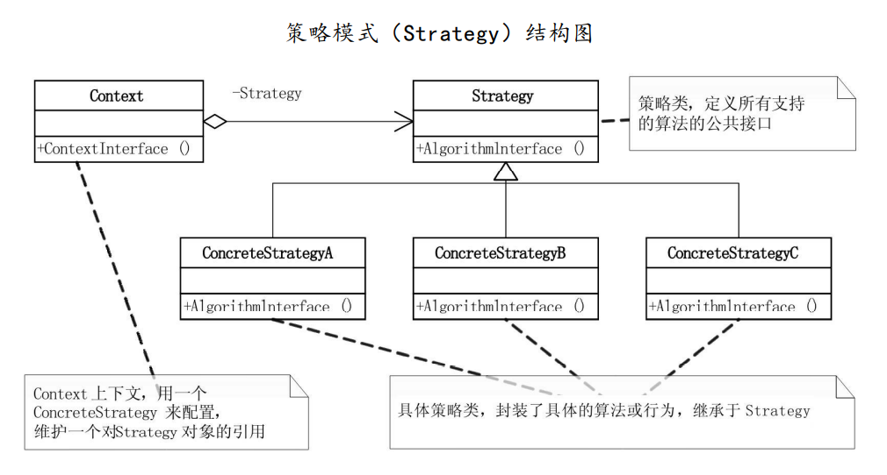
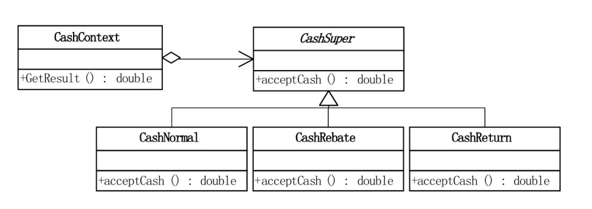

# 策略模式

## 1 问题引入

### 1.1 问题描述

&emsp;&emsp;大鸟给小菜出了个作业，要求用C++、Java、python、C#任意一种面向对象语言实现一个商场收银软件程序，营业员可以通过输入客户所有购买商品的单价和数量，程序自动计算出总金额。

&emsp;&emsp;进一步地，商场有时会有打折活动（如商品打7折），或满减促销活动（如商品满300-100），程序应能考虑这些活动的情形，实现正确的金额计算。

### 1.2 问题分析

&emsp;&emsp;实现该目标的程序需满足：商场促销活动变化繁多，如打7折，打8折，满300-100，满700-200等，这些促销活动逻辑类似，而且随时可以相互替换，应设计合理的程序结构，使得程序封装合理。

### 1.3 解决方案

&emsp;&emsp;此时可以考虑使用`策略模式`来解决问题。
1. 首先创建抽象的算法类`CashSupur`，作为所有促销活动算法的抽象类，同时定义所有支持算法的公共接口，定义方法`acceptCash()`用于得到结果；
2. 创建具体的促销算法类`CashNormal`，`CashRebate`等，继承于抽象算法类`CashSupur`，覆写`acceptCash()`实现具体的促销算法；
3. 创建上下文类`CashContext`，维护对算法对象的引用，使用时根据用户输入，传入一个具体的促销算法类来配置。

### 1.4 代码实现

* C++语言实现：[链接](https://github.com/datawhalechina/sweetalk-design-pattern/tree/main/src/design_patterns/cpp/strategy/)
* Java语言实现：[链接](https://github.com/datawhalechina/sweetalk-design-pattern/tree/main/src/design_patterns/java/strategy/)
* python语言实现：[链接](https://github.com/datawhalechina/sweetalk-design-pattern/tree/main/src/design_patterns/python/strategy/Strategy.py)
* C#语言实现见原书第二版。

## 2 模式介绍

### 2.1 定义

&emsp;&emsp;`策略模式（Strategy Pattern）`是指定义一个算法家族，使得家族内的不同算法都遵从算法家族的接口及方法规范，从而可以实现算法间互相替换。

### 2.2 结构

&emsp;&emsp;结构示意图如下

&emsp;&emsp;以上述问题为例，结构如下

## 3 适用场景

> 一个系统中有多个算法和类很相似，区分这些类和算法的只是其内部行为。

&emsp;&emsp;例如：
* 在导航应用中，有不同的路径规划算法，如针对步行的、骑行的、搭乘公共交通工具的、以及开车的等。主要导航类的主要工作是在地图上渲染出规划好的路径，并不会在意是由和算法生成的路径。此时可以将路径规划算法使用策略模式进行封装，方便与主要导航类的交互。

## 4 评价

### 4.1 优点

* 可以以相同的方式调用所有算法，减少了各种算法类与使用算法类之间的耦合。策略模式的Strategy类层次为Context类定义了一系列的可供重复使用的算法或行为，继承有助于析取这些算法中的公共功能。
* 简化了单元测试。每个算法都有自己的类，可以通过自己的接口单独测试；
* 符合“开放封闭原则”，无需对上下文进行修改就可以引入新的策略。

### 4.2 缺点

* 不适合算法极少发生改变的场景，会使得程序整体过于复杂；
* 要求客户端必须知晓策略间的不同，因为需要从中选择；

## 参考资料
1. 《深入设计模式》