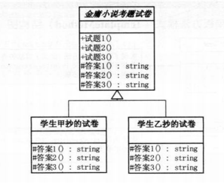

# 模板方法模式

## 1 问题引入

### 1.1 问题描述

&emsp;&emsp;抄考题，包括题目和答案。

### 1.2 问题分析
&emsp;&emsp;尽可能减少所有重复的代码。

### 1.3 解决方案
1. 对于不同的学生，只有给出的答案不同，其他全都一样
    - 将所有的重复代码都上升到父类，使其称为子类的**模板** --> 将公共的试题代码写到父类，试题和答案都继承于它
    - 只将答案改成一个虚方法，给继承的子类重写
2. 在客户端代码中，将子类变量的声明改成父类，利用多态实现代码复用

### 1.4 代码实现

* C++语言实现：[链接]("https://github.com/datawhalechina/sweetalk-design-pattern/src/design_patterns/cpp/template_method/")
* Java语言实现：[链接]("https://github.com/datawhalechina/sweetalk-design-pattern/src/design_patterns/java/template_method/")
* python语言实现：[链接]("https://github.com/datawhalechina/sweetalk-design-pattern/src/design_patterns/python/template_method/TemplateMethod.py")
* C#语言实现见原书第二版。

## 2 模式介绍

### 2.1 定义
&emsp;&emsp;`模板方法模式`定义了一个操作中的算法的骨架，将一些步骤延迟到子类中。

&emsp;&emsp;子类可以按需重写方法实现，但调用将以抽象类中定义的方式进行。

### 2.2 结构

以上述问题为例，结构如下

## 3 适用场景

- 有多个子类共有的方法，且逻辑相同；
- 重要的、复杂的方法，可以考虑作为模板方法。

**应用实例**
- 在造房子的时候，地基、走线、水管都一样，只有在建筑的后期才有加壁橱加栅栏等差异；
- Spring 中对 Hibernate 的支持，将一些已经定好的方法封装起来，比如开启事务、获取 Session、关闭 Session 等，程序员不重复写那些已经规范好的代码，直接丢一个实体就可以保存。

## 4 评价
### 4.1 优点
- 把不变的形为搬到超类，去除了子类中的重复代码，提供了很好的代码复用平台，便于维护；
- 封装不变部分，扩展可变部分；
- 行为由父类控制，子类实现；

### 4.2 缺点
&emsp;&emsp;每一个不同的实现都需要一个子类实现，导致类的个数增加，使得系统更加庞大。

## 5 参考资料
&emsp;&emsp;[模板模式 - 菜鸟教程](https://www.runoob.com/design-pattern/template-pattern.html)