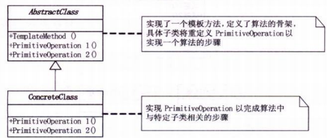

# 模板方法模式

## 模式引入

### 问题描述

回想小时候的随堂测验，老师在黑板上抄题目，同学们在下面先抄题目，再做答案。经常有同学眼神不好，会把题目抄错。

但是在考试时，就不会出现这种情况。因为大家拿到的考试试卷都是一样的。这里的考试试卷类似于一个模板，提取了相同的部分。

### 模式定义

`模板方法模式`定义了一个操作中的算法的骨架，将一些步骤延迟到子类中。

子类可以按需重写方法实现，但调用将以抽象类中定义的方式进行。

### 问题分析

尽可能减少所有重复的代码。

## 模式介绍

### 解决方案

- 对于不同的学生，只有给出的答案不同，其他内容全都一样；
    - 将所有的重复代码都上升到父类，使其称为子类的**模板** --> 将公共的试题代码写到父类，试题和答案都继承于它；
    - 只将答案改成一个虚方法，给继承的子类重写；
- 在客户端代码中，将子类变量的声明改成父类，利用多态实现代码复用。

### 代码实现

考题试卷的抽象类：
```java
public abstract class TestPaper {
    public void testQuestion1() {
        System.out.println("杨过得到，后来给了郭靖，炼成倚天剑、屠龙刀的玄铁可能是[ ] a.球墨铸铁 b.马口铁 c.高速合金钢 d.碳素纤维");
        System.out.println("答案：" + answer1());
    }

    public void testQuestion2() {
        System.out.println("杨过、程英、陆无双铲除了情花，造成[ ] a.使这种植物不再害人 b.使一种珍稀物种灭绝了 c.破坏了那个生物圈的生态平衡 d.造成该地区沙漠化");
        System.out.println("答案：" + answer2());
    }

    public void testQuestion3() {
        System.out.println("蓝凤凰致使华山师徒、桃谷六仙呕吐不止，如果你是大夫，会给他们开什么药[ ] a.阿司匹林 b.牛黄解毒片 c.氟哌酸 d.让他们喝大量的生牛奶 e.以上全不对");
        System.out.println("答案：" + answer3());
    }

    protected abstract String answer1();

    protected abstract String answer2();

    protected abstract String answer3();
}
```

学生甲抄试卷的具体类：
```java
public class TestPaperA extends TestPaper {
    @Override
    protected String answer1() {
        return "b";
    }

    @Override
    protected String answer2() {
        return "c";
    }

    @Override
    protected String answer3() {
        return "a";
    }
}
```

学生乙抄试卷的具体类：
```java
public class TestPaperB extends TestPaper {
    @Override
    protected String answer1() {
        return "c";
    }

    @Override
    protected String answer2() {
        return "a";
    }

    @Override
    protected String answer3() {
        return "a";
    }
}
```

客户端代码：
```java
public class TemplateMethodMain {
    public static void main(String[] args) {
        System.out.println("学生甲抄的试卷：");
        TestPaper studentA = new TestPaperA();
        studentA.testQuestion1();
        studentA.testQuestion2();
        studentA.testQuestion3();

        System.out.println("学生乙抄的试卷：");
        TestPaper studentB = new TestPaperB();
        studentB.testQuestion1();
        studentB.testQuestion2();
        studentB.testQuestion3();
    }
}
```

执行结果：

```bash
学生甲抄的试卷：
杨过得到，后来给了郭靖，炼成倚天剑、屠龙刀的玄铁可能是[ ] a.球墨铸铁 b.马口铁 c.高速合金钢 d.碳素纤维
答案：b
杨过、程英、陆无双铲除了情花，造成[ ] a.使这种植物不再害人 b.使一种珍稀物种灭绝了 c.破坏了那个生物圈的生态平衡 d.造成该地区沙漠化
答案：c
蓝凤凰致使华山师徒、桃谷六仙呕吐不止，如果你是大夫，会给他们开什么药[ ] a.阿司匹林 b.牛黄解毒片 c.氟哌酸 d.让他们喝大量的生牛奶 e.以上全不对
答案：a
学生乙抄的试卷：
杨过得到，后来给了郭靖，炼成倚天剑、屠龙刀的玄铁可能是[ ] a.球墨铸铁 b.马口铁 c.高速合金钢 d.碳素纤维
答案：c
杨过、程英、陆无双铲除了情花，造成[ ] a.使这种植物不再害人 b.使一种珍稀物种灭绝了 c.破坏了那个生物圈的生态平衡 d.造成该地区沙漠化
答案：a
蓝凤凰致使华山师徒、桃谷六仙呕吐不止，如果你是大夫，会给他们开什么药[ ] a.阿司匹林 b.牛黄解毒片 c.氟哌酸 d.让他们喝大量的生牛奶 e.以上全不对
答案：a
```

### 结构组成



- AbstractClass：抽象类，也就是一个抽象模板，定义并实现了一个模板方法。这个模板方法一般是一个具体方法，给出了顶级逻辑的骨架；
- ConcreteClass：子类，实现父类所定义的一个或多个抽象方法。每一个ConcreteClass都可以给出抽象方法的不同实现。

## 模式评价

### 适用场景

- 有多个子类共有的方法，且逻辑相同；
- 重要的、复杂的方法，可以考虑作为模板方法。

### 实际应用

- Spring 中对 Hibernate 的支持，将一些已经定好的方法封装起来，比如开启事务、获取 Session、关闭 Session 等，程序员不重复写那些已经规范好的代码，直接丢一个实体就可以保存；
- 在造房子的时候，地基、走线、水管都一样，只有在建筑的后期才有加壁橱加栅栏等差异；

### 优点缺点

优点：
- 把不变的形为搬到超类，去除了子类中的重复代码，提供了很好的代码复用平台，便于维护；
- 封装不变部分，扩展可变部分；
- 行为由父类控制，子类实现；

缺点：
每一个不同的实现都需要一个子类实现，导致类的个数增加，使得系统更加庞大。