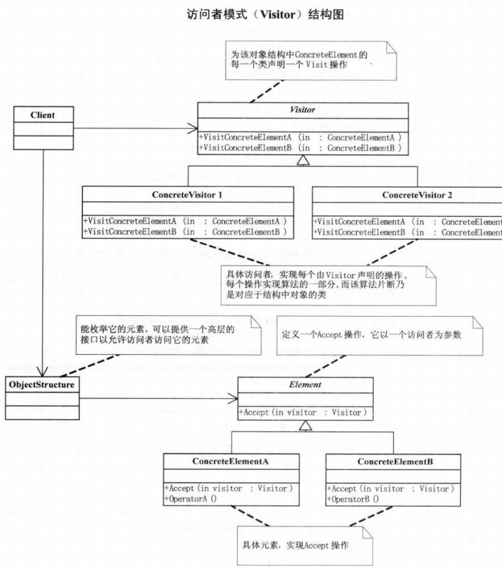

# 访问者模式

## 问题引入

### 问题描述

男人和女人是完全不同的两类人，在对待各种问题上会有完全不同的态度，如何实现男人和女人各方面的对比。

### **模式定义**

访问者模式：表示一个作用于某对象结构中的各元素操作。可以再不改变元素的类的前提下定义于这些元素的新操作。

### 问题分析

男人和女人应该是两个不同类，应该继承一个抽象类。成功、失败等都是人的状态应该作为属性存在。成功会如何、失败会如何应该作为一种反应存在。需要注意的是需要对类的不同对象执行不同操作，但是又不希望增加操作的时候改变这些类。

## 模式介绍

### 解决方案

访问者模式可以把处理从数据结构中分离出来，从而降低数据结构和作用于结构上的操作之间的耦合，使得操作集合可以相对自由变化。

### 代码实现

```java
public abstract class Person {
    public abstract void accept(Action visitor);
}

public class Woman extends Person {
    protected String name = "女人";

    @Override
    public void accept(Action visitor) {
        visitor.getWomanConclusion(this);
    }
}

public class Woman extends Person {
    protected String name = "女人";

    @Override
    public void accept(Action visitor) {
        visitor.getWomanConclusion(this);
    }
}

public abstract class Action {
    public abstract void getManConclusion(Man man);
    public abstract void getWomanConclusion(Woman woman);
}


public class Amativeness extends Action {
    private String name = "恋爱";

    @Override
    public void getManConclusion(Man man) {
        System.out.println(man.name + this.name + "时，凡事不懂也要装懂。");
    }

    @Override
    public void getWomanConclusion(Woman woman) {
        System.out.println(woman.name + this.name + "时，遇事懂也装作不懂。");
    }
}

public class Failing extends Action {
    private String name = "失败";

    @Override
    public void getManConclusion(Man man) {
        System.out.println(man.name + this.name + "时，闷头喝酒，谁也不用劝。");
    }

    @Override
    public void getWomanConclusion(Woman woman) {
        System.out.println(woman.name + this.name + "时，眼泪汪汪，谁也劝不了。");
    }
}

public class Success extends Action {
    private String name = "成功";

    @Override
    public void getManConclusion(Man man) {
        System.out.println(man.name + this.name + "时，背后多半有一个伟大的女人。");
    }

    @Override
    public void getWomanConclusion(Woman woman) {
        System.out.println(woman.name + this.name + "时，背后大多有一个不成功的男人。");
    }
}

public class Marriage extends Action {
    private String name = "结婚";

    @Override
    public void getManConclusion(Man man) {
        System.out.println(man.name + this.name + "时，感慨到：恋爱游戏终结时，’有妻徒刑’遥无期。" );
    }

    @Override
    public void getWomanConclusion(Woman woman) {
        System.out.println(woman.name + this.name + "时，欣慰曰：爱情长跑路漫漫，婚姻保险保平安。");
    }
}

public class ObjectStructure {
    private List<Person> elements = new ArrayList<>();

    public void attach(Person element) {
        elements.add(element);
    }

    public void detach(Person element) {
        elements.remove(element);
    }

    public void display(Action visitor) {
        for(Person e : elements){
            e.accept(visitor);
        }
    }
}

public class Main {
    public static void main(String[] args) {
        ObjectStructure o = new ObjectStructure();

        o.attach(new Man());
        o.attach(new Woman());

        Success v1 = new Success();
        o.display(v1);

        Failing v2 = new Failing();
        o.display(v2);

        Amativeness v3 = new Amativeness();
        o.display(v3);

        Marriage v4 = new Marriage();
        o.display(v4);
    }
}

```

### **结构**组成



## 模式评价

**适合场景**

系统中对象对应的类很少改变，即有较稳定的数据结构，但是经常会定义新的操作。

**实际应用**

1.Spring在beans配置中实现了访问者设计模式

2.JSP的解析器,Jasper框架利用的访问模式来解析HTML和XML格式

3.ShardingSphere在SQL解析中使用了大量的访问者模式

**模式优点**

增加新的操作很容易。访问者模式将有关的行为集中到一个访问者对象中。

**模式缺点**

增加新的数据结构变得困难。因为一般数据结构都会变化，所以使用访问者模式的机会不太多。